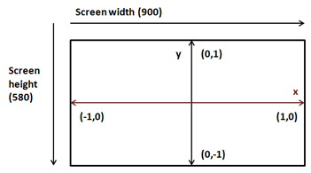
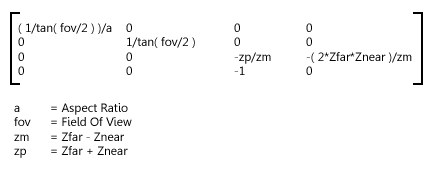

# 变换（Transformations）

## 投影

让我们回看在前一章中创建的色彩鲜艳的正方形。如果仔细看，它更像一个矩形，你甚至可以将窗口的宽度从600像素改为900像素，失真就会更加明显。这发生了什么呢？

如果你查看顶点着色器的代码，我们只是直接地传递坐标。换句话说，当一个顶点的X坐标为0.5时，我们让OpenGL在屏幕的X坐标为0.5的位置绘制它。下图展示了OpenGL坐标系（仅含X和Y轴）。


将这些坐标投影到窗口坐标系（其原点位于上图的左上角），需要考虑到窗口的大小。因此，如果我们的窗口大小为900x480，OpenGL坐标(1, 0)将被投影到窗口坐标(900, 0)，最终创建一个矩形而不是一个正方形。



但是，问题远比这更严重。将四边形的Z坐标从0.0修改为1.0和-1.0，你发现了什么？四边形完全是绘制在同一个地方，不管它是否沿着Z轴位移。为什么会发生这种情况？远处的物体应该比近处的物体绘制得更小，但是我们使用相同的X和Y坐标绘制它们。

但稍等一下，这不应该由Z坐标来处理吗？这半对半错。Z坐标告诉OpenGL一个物体的远近，但是OpenGL对你的物体的大小一无所知。你可以有两个不同大小的物体，一个更近更小，一个更远更大，而且可以以相同的大小正确地投影到屏幕上（有相同的屏幕X和Y坐标，但Z坐标不同）。OpenGL只使用正在传递的坐标，所以我们必须处理这个问题，我们需要正确地投影坐标。

既然已经确诊了这个问题，该怎么解决呢？答案是使用投影矩阵（Projection Matrix）或截锥体（Frustum）。投影矩阵将处理绘制区域的宽高比（大小与高度之间的关系），这样物体就不会变形。它还可以处理距离，所以较远的物体将会被绘制得更小。投影矩阵还将考虑我们的视野和应该显示的距离有多远。

对于不熟悉矩阵的人，矩阵（Matrix）是以行和列排列的二维数组。矩阵中的每个数字被称为元素。矩阵阶次是行和列的数量。例如，此处是一个2x2矩阵（有2行2列）。


矩阵有许多可以应用于它们的基本运算（如加法、乘法等），你可以在数学书中查阅，其中与三维图形相关的矩阵对空间中点的变换非常有用。

你可以把投影矩阵想象成一个摄像机，它有一个视野和最小和最大距离。该摄像机的可视区域是一个截断的金字塔，下图为该区域的俯视图。


投影矩阵将正确地投影三维坐标，以便它们能够在二维屏幕上正确地显示。该矩阵的数学表示如下（不要害怕）：



其中屏幕宽高比（Aspect Ratio）指的是屏幕宽度与屏幕高度的关系（$屏幕宽高比=宽度/高度$）。为了获得给定点的投影坐标，只需要将投影矩阵乘以原始坐标，结果是投影后的另一个向量。

因此，我们需要处理一组数学实体，如向量、矩阵，并包括可以对它们进行的运算。我们可以选择从头开始编写所有的代码，或者使用已实现的库。当然我们会选择容易的方法，使用JOML（Java OpenGL Math Library，Java OpenGL 数学库）处理LWJGL内的数学运算。为了使用该库，我们只需要在`pom.xml`文件添加另一个依赖项。

```xml
        <dependency>
            <groupId>org.joml</groupId>
            <artifactId>joml</artifactId>
            <version>${joml.version}</version>
        </dependency>
```

然后设置要使用的库版本。

```xml
    <properties>
        [...]
        <joml.version>1.9.6</joml.version>
        [...]
    </properties>
```

现在一切都准备好了，来定义我们的投影矩阵。在`Renderer`类中创建`Matrix4f`类（由JOML库提供）的实例。`Matrix4f`类提供了一个`perspective`方法来创建投影矩阵，该方法需要以下参数：

* 视野：可视区域角的弧度大小，我们将定义一个储存该值的常数。
* 屏幕宽高比。
* 最近视距（z-near）。
* 最远视距（z-far）。

我们将在`init`方法中实例化该矩阵，因此需要传递对`Window`实例的阴影以获取窗口大小（你可以查看源代码）。代码如下：

```java
    /**
     * 视野弧度
     */
    private static final float FOV = (float) Math.toRadians(60.0f);

    private static final float Z_NEAR = 0.01f;

    private static final float Z_FAR = 1000.f;

    private Matrix4f projectionMatrix;
```

投影矩阵的创建如下所示：

```java
float aspectRatio = (float) window.getWidth() / window.getHeight();
projectionMatrix = new Matrix4f().perspective(FOV, aspectRatio,
    Z_NEAR, Z_FAR);
```

现在我们省略宽高比可变的情况（通过调整窗口大小），这可以在`render`方法中检查并相应地改变投影矩阵。

现在有了矩阵，该如何使用它呢？我们需要在着色器中使用它，并且它应该被应用到所有顶点上。首先，你可能会想到把它捆绑在顶点输入中（就像坐标和颜色那样）。但这样，我们会浪费很多空间，因为投影矩阵在几次渲染期间都不会发生改变。你可能还想在Java代码中用矩阵处理所有顶点，但这样我们输入的VBO就是没用的了，这样就不能使用显卡中的处理器资源了。

答案是使用“`uniform`”。Uniform是着色器可以使用的全局的GLSL变量，我们将使用它与着色器交流。

所以我们需要修改顶点着色器的代码，并声明一个新的名为`projectionMatrix`的Uniform，并用它来计算投影后的位置。

```glsl
#version 330

layout (location=0) in vec3 position;
layout (location=1) in vec3 inColour;

out vec3 exColour;

uniform mat4 projectionMatrix;

void main()
{
    gl_Position = projectionMatrix * vec4(position, 1.0);
    exColour = inColour;
}
```

如上所述，我们把`projectionMatrix`定义为一个4x4的矩阵，新的坐标是通过把它与原始坐标相乘得到的。现在我们需要把投影矩阵的值传递给着色器，首先需要确定Uniform的位置。

这是通过调用方法`glGetUniformLocation`实现的，它有两个参数：

* 着色器程序的ID
* Uniform名（它应该与着色器里定义的名称相同）

此方法返回储存Uniform位置的ID。由于可能有一个以上的Uniform，我们将把这些ID储存在由变量名作为索引的Map中（此后我们需要那个ID）。因此，在`ShaderProgram`需要创建一个新的字段来保存这些ID：

```java
private final Map<String, Integer> uniforms;
```

然后由构造方法初始化它：

```java
uniforms = new HashMap<>();
```

最后，我们创建了一个方法来创建新的Uniform和储存获得的位置。

```java
public void createUniform(String uniformName) throws Exception {
    int uniformLocation = glGetUniformLocation(programId,
        uniformName);
    if (uniformLocation < 0) {
        throw new Exception("Could not find uniform:" +
            uniformName);
    }
    uniforms.put(uniformName, uniformLocation);
}
```

现在，在着色器程序编译后，我们就可以在`Renderer`类中调用`createUniform`方法（本例中，我们将在投影矩阵实例化后调用它）。

```java
shaderProgram.createUniform("projectionMatrix");
```

此时，我们已经准备好一个可以储存投影矩阵数据的储存器。由于投影矩阵在渲染期间不会变化，所以可以在创建Uniform后直接设置值，但我们将在`render`方法中做此事。稍后你可以看到，我们可以重用该Uniform来执行每次渲染调用中需要执行的其他操作。

我们将在`ShaderProgram`类中创建另一个名为`setUniform`的方法来设置数据，通过使用JOML库提供的实用方法将矩阵转换为4x4的`FloatBuffer`对象，并将它们发送到Uniform中。

```java
public void setUniform(String uniformName, Matrix4f value) {
    // 转储矩阵到FloatBuffer
    try (MemoryStack stack = MemoryStack.stackPush()) {
        FloatBuffer fb = stack.mallocFloat(16);
        value.get(fb);
        glUniformMatrix4fv(uniforms.get(uniformName), false, fb);
    }
}
```

如你所见，我们用与此前不同的方式创建缓冲区。我们使用的是自动管理的缓冲区，并将它们分配到堆栈上。这是因为这个缓冲区的大小很小，并且在该方法之外不会使用它。因此我们使用`MemoryStack`类。

现在，在着色器绑定之后，可以在`Renderer`类的`render`方法中调用该方法：

```java
shaderProgram.setUniform("projectionMatrix", projectionMatrix);
```

我们就要完成了，现在可以正确地渲染四边形，所以现在可以启动程序，然后得到一个...黑色背景，没有任何彩色四边形。发生了什么？我们把什么弄坏了吗？实际上没有任何问题。记住我们正在模拟摄像机观察场景的效果。我们提供了两个距离，一个是最远视距（1000f）和一个最近视距（0.01f）。而我们的坐标是：

```java
float[] positions = new float[]{
    -0.5f,  0.5f, 0.0f,
    -0.5f, -0.5f, 0.0f,
     0.5f, -0.5f, 0.0f,
     0.5f,  0.5f, 0.0f,
};
```

也就是说，我们坐标中的Z坐标位于可视区域之外。将它们赋值为-0.05f，现在你会看到像这样的一个巨大的绿色正方形：


这是因为，我们正绘制出离摄像机太近的正方形，实际上是在放大它。如果现在把一个`-1.05f`的值赋值给Z坐标，就可以看到彩色正方形了。


如果继续向后移动四边形，我们会看到它变小了。还要注意到四边形不再像矩形了。

## 使用变换

回想一下到目前为止我们都做了什么。我们已经学会了如何将数据以有效的格式传递给显卡，以及如何使用顶点和片元着色器来投影这些顶点并设置它们的颜色。现在应该开始在三维空间中绘制更复杂的模型了，但为了做到它，我们必须能够加载模型，并在指定的位置以适当的大小和所需的旋转将它渲染在三维空间中。

现在为了实现这样的渲染，我们需要提供一些基本操作来操作模型：

* 位移（Translation）: 在三个轴中的任意一个轴上移动一个物体。
* 旋转（Rotation）: 按任意一个轴旋转物体任意角度。
* 缩放（Scale）: 调整物体的大小。


上面的操作统称为变换（Transformation）。你可能猜到要实现这一点的方法是把坐标乘以一组矩阵（一个用于移动，一个用于旋转，一个用于缩放）。这三个矩阵将被组合成一个称为“世界矩阵”的矩阵，并作为一个Uniform传递给顶点着色器。

之所以被称为世界矩阵，是因为我们正在将模型坐标转换为世界坐标。当学习加载3D模型时，你会发现这些模型是在它们自己的坐标系中定义的，它们不知道你的三维空间的大小，但它们需要在里面渲染。因此，当我们用矩阵乘以坐标时，实际上做的是从一个坐标系（模型坐标系）转换到另一个坐标系（三维世界坐标系）。

世界矩阵应该这样计算（顺序很重要，因为乘法交换律不适用于矩阵）:

$$世界矩阵=\left[位移矩阵\right]\left[旋转矩阵\right]\left[缩放矩阵\right]$$

如果把投影矩阵包含在变换矩阵中，它会是这样的：

$$
\begin{array}{lcl}
Transf & = & \left[投影矩阵\right]\left[位移矩阵\right]\left[旋转矩阵\right]\left[缩放矩阵\right] \\
 & = & \left[投影矩阵\right]\left[世界矩阵\right]
\end{array}
$$

位移矩阵是这样定义的：

$$
\begin{bmatrix}
1 & 0 & 0 & dx \\
0 & 1 & 0 & dy \\
0 & 0 & 1 & dz \\
0 & 0 & 0 & 1
\end{bmatrix}
$$

位移矩阵的参数如下：

* dx: 沿X轴位移。
* dy: 沿Y轴位移。
* dz: 沿Z轴位移。

缩放矩阵是这样定义的；

$$
\begin{bmatrix}
sx & 0 & 0 & 0 \\
0 & sy & 0 & 0 \\
0 & 0 & sz & 0 \\
0 & 0 & 0 & 1
\end{bmatrix}
$$

缩放矩阵的参数如下：

* sx: 沿着X轴缩放。
* sy: 沿着Y轴缩放。
* sz: 沿着Z轴缩放。

旋转矩阵要复杂得多，但请记住，它可以由每个绕单独的轴旋转的旋转矩阵相乘得到。

现在，为了实践这些理论，我们需要重构代码一点点。在游戏中，我们将加载一组模型，用来根据游戏逻辑在不同的位置渲染许多物体（想象一个FPS游戏，它载入了三个不同敌人的模型。确实只有三个模型，但使用这些模型，我们可以渲染想要的任意数量的敌人）。我们需要为每个对象创建一个VAO和一组VBO吗？答案是不需要，只需要每个模型加载一次就行。我们需要做的是根据它的位置，大小和旋转来独立地绘制它。当渲染这些模型时，我们需要对它们进行变换。

因此，我们将创建一个名为`GameItem`的新类，该类将模型加载到`Mesh`实例中。一个`GameItem`实例将由变量储存它的位置、旋转状态和缩放。如下是该类的定义。

```java
package org.lwjglb.engine;

import org.joml.Vector3f;
import org.lwjglb.engine.graph.Mesh;

public class GameItem {

    private final Mesh mesh;

    private final Vector3f position;

    private float scale;

    private final Vector3f rotation;

    public GameItem(Mesh mesh) {
        this.mesh = mesh;
        position = new Vector3f(0, 0, 0);
        scale = 1;
        rotation = new Vector3f(0, 0, 0);
    }

    public Vector3f getPosition() {
        return position;
    }

    public void setPosition(float x, float y, float z) {
        this.position.x = x;
        this.position.y = y;
        this.position.z = z;
    }

    public float getScale() {
        return scale;
    }

    public void setScale(float scale) {
        this.scale = scale;
    }

    public Vector3f getRotation() {
        return rotation;
    }

    public void setRotation(float x, float y, float z) {
        this.rotation.x = x;
        this.rotation.y = y;
        this.rotation.z = z;
    }

    public Mesh getMesh() {
        return mesh;
    }
}
```

我们将创建一个名为`Transformation`的类，让它来处理变换。

```java
package org.lwjglb.engine.graph;

import org.joml.Matrix4f;
import org.joml.Vector3f;

public class Transformation {

    private final Matrix4f projectionMatrix;

    private final Matrix4f worldMatrix;

    public Transformation() {
        worldMatrix = new Matrix4f();
        projectionMatrix = new Matrix4f();
    }

    public final Matrix4f getProjectionMatrix(float fov, float width, float height, float zNear, float zFar) {
        float aspectRatio = width / height;        
        projectionMatrix.identity();
        projectionMatrix.perspective(fov, aspectRatio, zNear, zFar);
        return projectionMatrix;
    }

    public Matrix4f getWorldMatrix(Vector3f offset, Vector3f rotation, float scale) {
        worldMatrix.identity().translate(offset).
                rotateX((float)Math.toRadians(rotation.x)).
                rotateY((float)Math.toRadians(rotation.y)).
                rotateZ((float)Math.toRadians(rotation.z)).
                scale(scale);
        return worldMatrix;
    }
}
```

如你所见，这个类把投影矩阵和世界矩阵组合起来。给定一组参数来进行位移、旋转和缩放，然后返回世界矩阵。`getWorldMatrix`返回的结果将为每个`GameItem`实例变换坐标。该类还提供了获得投影矩阵的方法。

需要注意的一件事是，`Matrix4f`类的`mul`方法修改了该实例的内容。因此，如果直接将投影矩阵与变换矩阵相乘，我们会修改投影矩阵本身，这就是为什么总是在每次调用时将每个矩阵初始化为单位矩阵。

在`Renderer`类的构造方法中，我们仅实例化了没有任何参数的`Transformation`类，而在`init`方法中，我们只创建了Uniform。

```java
public Renderer() {
    transformation = new Transformation();
}

public void init(Window window) throws Exception {
    // ... 此前的一些代码 ...
    // 为世界矩阵和投影矩阵创建Uniform
    shaderProgram.createUniform("projectionMatrix");
    shaderProgram.createUniform("worldMatrix");

    window.setClearColor(0.0f, 0.0f, 0.0f, 0.0f);
}
```

在`Renderer`类的渲染方法中，现在可以接收到一个`GameItem`的数组：

```java
public void render(Window window, GameItem[] gameItems) {
    clear();

        if ( window.isResized() ) {
            glViewport(0, 0, window.getWidth(), window.getHeight());
            window.setResized(false);
        }

    shaderProgram.bind();

    // 更新投影矩阵
    Matrix4f projectionMatrix = transformation.getProjectionMatrix(FOV, window.getWidth(), window.getHeight(), Z_NEAR, Z_FAR);
    shaderProgram.setUniform("projectionMatrix", projectionMatrix);        

    // 渲染每一个游戏项
    for(GameItem gameItem : gameItems) {
        // 为该项设置世界矩阵
        Matrix4f worldMatrix =
            transformation.getWorldMatrix(
                gameItem.getPosition(),
                gameItem.getRotation(),
                gameItem.getScale());
        shaderProgram.setUniform("worldMatrix", worldMatrix);
        // 为该游戏项渲染网格
        gameItem.getMesh().render();
    }

    shaderProgram.unbind();
}
```

每次调用`render`时就更新投影矩阵一次，这样我们可以处理窗口大小的调整操作。然后我们遍历`GameItem`数组，并根据它们各自的位置、旋转和缩放创建变换矩阵，该矩阵将被传递到着色器并绘制`Mesh`。投影矩阵对于所有要渲染的项目都是相同的，这就是为什么它在`Transformation`类中是单独一个变量的原因。

我们将渲染代码移动到`Mesh`类中：

```java
public void render() {
    // 绘制Mesh
    glBindVertexArray(getVaoId());
    glEnableVertexAttribArray(0);
    glEnableVertexAttribArray(1);

    glDrawElements(GL_TRIANGLES, getVertexCount(), GL_UNSIGNED_INT, 0);

    // 重置状态
    glDisableVertexAttribArray(0);
    glDisableVertexAttribArray(1);
    glBindVertexArray(0);
}
```

顶点着色器只需简单地添加一个新的`worldMatrix`矩阵，然后用它与`projectionMatrix`一同计算坐标：

```glsl
#version 330

layout (location=0) in vec3 position;
layout (location=1) in vec3 inColour;

out vec3 exColour;

uniform mat4 worldMatrix;
uniform mat4 projectionMatrix;

void main()
{
    gl_Position = projectionMatrix * worldMatrix * vec4(position, 1.0);
    exColour = inColour;
}
```

如你所见，代码完全一致。我们使用Uniform来正确地投影坐标，并且考虑截锥、位置、缩放和旋转等。

另外一个重要的问题是，为什么不直接使用位移、旋转和缩放矩阵，而是把它们组合成一个世界矩阵呢？原因是我们应该尽量减少在着色器中使用的矩阵。还要记住，在着色器中所做的矩阵乘法是每个顶点一次，投影矩阵在渲染调用期间不会改变，而每一个`GameItem`实例的世界矩阵也不会改变。如果独立位移、旋转和缩放矩阵，我们要做更多的矩阵乘法运算。在一个有超多顶点的模型中，这是很多余的操作。

但你现在可能会想，如果每个`GameItem`中的世界矩阵都不会发生变化，为什么不在Java类中做矩阵乘法？我们将投影矩阵和世界矩阵与每个`GameItem`相乘，把它们作为一个Uniform，在此情况下，我们确实能省下更多的操作。但当我们向游戏引擎中添加更多的特性时，我们需要在着色器中使用世界坐标，所以最好独立地处理这两个矩阵。

最后只需要修改`DummyGame`类，创建一个`GameItem`实例，让其与`Mesh`关联，并添加一些逻辑来位移、旋转和缩放四边形。因为这只是个测试示例，没有添加太多内容，所以你可以在本书的源代码中找到相关代码。
