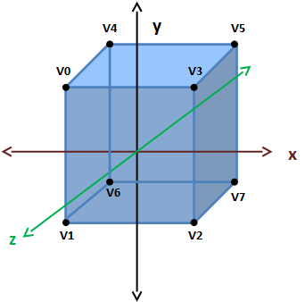
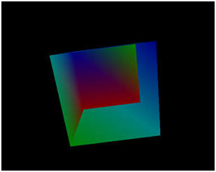
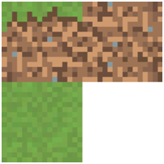

# 纹理（Textures）

## 创建一个三维立方体

在本章中，我们将学习如何在渲染中加载纹理并使用它们。为了讲解与纹理相关的所有概念，我们将把此前章节中使用的正方形更改为三维立方体。为了绘制一个立方体，我们只需要正确地定义一个立方体的坐标，就能使用现有代码正确地绘制它。

为了绘制立方体，我们只需要定义八个顶点。



因此，它的坐标数组将是这样的：

```java
float[] positions = new float[] {
    // VO
    -0.5f,  0.5f,  0.5f,
    // V1
    -0.5f, -0.5f,  0.5f,
    // V2
    0.5f, -0.5f,  0.5f,
    // V3
     0.5f,  0.5f,  0.5f,
    // V4
    -0.5f,  0.5f, -0.5f,
    // V5
     0.5f,  0.5f, -0.5f,
    // V6
    -0.5f, -0.5f, -0.5f,
    // V7
     0.5f, -0.5f, -0.5f,
};
```

当然，由于我们多了4个顶点，我们需要更改颜色数组，目前仅重复前四项的值。

```java
float[] colours = new float[]{
    0.5f, 0.0f, 0.0f,
    0.0f, 0.5f, 0.0f,
    0.0f, 0.0f, 0.5f,
    0.0f, 0.5f, 0.5f,
    0.5f, 0.0f, 0.0f,
    0.0f, 0.5f, 0.0f,
    0.0f, 0.0f, 0.5f,
    0.0f, 0.5f, 0.5f,
};
```

最后，由于立方体是由六个面构成的，需要绘制十二个三角形（每个面两个），因此我们需要修改索引数组。记住三角形必须按逆时针顺序定义，如果你直接去定义三角形，很容易犯错。一定要将你想定义的面摆在你的面前，确认顶点并以逆时针顺序绘制三角形。

```java
int[] indices = new int[] {
    // 前面
    0, 1, 3, 3, 1, 2,
    // 上面
    4, 0, 3, 5, 4, 3,
    // 右面
    3, 2, 7, 5, 3, 7,
    // 左面
    6, 1, 0, 6, 0, 4,
    // 下面
    2, 1, 6, 2, 6, 7,
    // 后面
    7, 6, 4, 7, 4, 5,
};
```

为了更好观察立方体，我们将修改`DummyGame`类中旋转模型的代码，使模型沿着三个轴旋转。

```java
// 更新旋转角
float rotation = gameItem.getRotation().x + 1.5f;
if ( rotation > 360 ) {
    rotation = 0;
}
gameItem.setRotation(rotation, rotation, rotation);
```

这就完了，现在能够显示一个旋转的三维立方体了，你可以编译和运行示例代码，会得到如下所示的东西。



这个立方体有些奇怪，有些面没被正确地绘制，这发生了什么？立方体之所以出现这个现象，是因为组成立方体的三角形是以一种随机顺序绘制的。事实上距离较远的像素应该在距离较近的像素之前绘制，而不是现在这样。为了修复它，我们必须启用深度测试（Depth Test）。

这将在`Window`类的`init`方法中去做：

```java
glEnable(GL_DEPTH_TEST);
```

现在立方体被正确地渲染了！


如果你看了本章该小节的代码，你可能会看到`Mesh`类做了一下小规模的调整，VBO的ID现在被储存在一个List中，以便于迭代它们。

## 为立方体添加纹理

现在我们将把纹理应用到立方体上。纹理（Texture）是用来绘制某个模型的像素颜色的图像，可以认为纹理是包在三维模型上的皮肤。你要做的是将纹理图像中的点分配给模型中的顶点，这样做OpenGL就能根据纹理图像计算其他像素的颜色。


纹理图像不必与模型同样大小，它可以变大或变小。如果要处理的像素不能映射到纹理中的指定点，OpenGL将推断颜色。可在创建纹理时控制如何进行颜色推断。

因此，为了将纹理应用到模型上，我们必须做的是将纹理坐标分配给每个顶点。纹理坐标系有些不同于模型坐标系。首先，我们的纹理是二维纹理，所以坐标只有X和Y两个量。此外，原点是图像的左上角，X或Y的最大值都是1。


我们如何将纹理坐标与位置坐标联系起来呢？答案很简单，就像传递颜色信息，我们创建了一个VBO，为每个顶点储存其纹理坐标。

让我们开始修改代码，以便在三维立方体上使用纹理吧。首先是加载将被用作纹理的图像。对此在LWJGL的早期版本中，通常使用Slick2D库。在撰写本文时，该库似乎与LWJGL 3不兼容，因此我们需要使用另一种方法。我们将使用LWJGL为[stb](https://github.com/nothings/stb)库提供的封装。为了使用它，首先需要在本地的`pom.xml`文件中声明依赖。

```xml
<dependency>
    <groupId>org.lwjgl</groupId>
    <artifactId>lwjgl-stb</artifactId>
    <version>${lwjgl.version}</version>
</dependency>
[...]
<dependency>
    <groupId>org.lwjgl</groupId>
    <artifactId>lwjgl-stb</artifactId>
    <version>${lwjgl.version}</version>
    <classifier>${native.target}</classifier>
    <scope>runtime</scope>
</dependency>
```

在一些教程中，你可能看到首先要做的事是调用`glEnable(GL_TEXTURE_2D)`来启用OpenGL环境中的纹理。如果使用固定管线这是对的，但我们使用GLSL着色器，因此不再需要了。

现在我们将创建一个新的`Texture`类，它将执行加载纹理所必须的步骤。首先，我们需要将图像载入到`ByteBuffer`中，代码如下：

```java
private static int loadTexture(String fileName) throws Exception {
    int width;
    int height;
    ByteBuffer buf;
    // 加载纹理文件
    try (MemoryStack stack = MemoryStack.stackPush()) {
        IntBuffer w = stack.mallocInt(1);
        IntBuffer h = stack.mallocInt(1);
        IntBuffer channels = stack.mallocInt(1);

        buf = stbi_load(fileName, w, h, channels, 4);
        if (buf == null) {
            throw new Exception("Image file [" + fileName  + "] not loaded: " + stbi_failure_reason());
        }
    
        /* 获得图像的高度与宽度 */
        width = w.get();
        height = h.get();
     }
	 [... 接下来还有更多代码 ...]
```

首先我们要为库分配`IntBuffer`，以返回图像大小与通道数。然后，我们调用`stbi_load`方法将图像加载到`ByteBuffer`中，该方法需要如下参数：

* `filePath`：文件的绝对路径。stb库是本地的，不知道关于`CLASSPATH`的任何内容。因此，我们将使用常规的文件系统路径。
* `width`：图像宽度，获取的图像宽度将被写入其中。
* `height`：图像高度，获取的图像高度将被写入其中。
* `channels`：图像通道。
* `desired_channels`：所需的图像通道，我们传入4（RGBA）。

一件关于OpenGL的重要事项，由于历史原因，要求纹理图像的大小（每个轴的像素数）必须是二的指数（2, 4, 8, 16, ....）。一些驱动解除了这种限制，但最好还是保持以免出现问题。

下一步是将纹理上传到显存中。首先需要创建一个新的纹理ID，与该纹理相关的操作都要使用该ID，因此我们需要绑定它。

```java
// 创建一个新的OpenGL纹理
int textureId = glGenTextures();
// 绑定纹理
glBindTexture(GL_TEXTURE_2D, textureId);
```

然后需要告诉OpenGL如何解包RGBA字节，由于每个分量只有一个字节大小，所以我们需要添加以下代码：

```java
glPixelStorei(GL_UNPACK_ALIGNMENT, 1);
```

最后我们可以上传纹理数据：

```java
glTexImage2D(GL_TEXTURE_2D, 0, GL_RGBA, width, height,
    0, GL_RGBA, GL_UNSIGNED_BYTE, buf);
```

`glTexImage2D`的参数如下所示：

* `target`: 指定目标纹理（纹理类型），本例中是`GL_TEXTURE_2D`。
* `level`: 指定纹理细节的等级。0级是基本图像等级，第n级是第n个多级渐远纹理的图像，之后再谈论这个问题。
* `internal format`: 指定纹理中颜色分量的数量。
* `width`: 指定纹理图像的宽度。
* `height`: 指定纹理图像的高度。
* `border`: 此值必须为0。
* `format`: 指定像素数据的格式，现在为RGBA。
* `type`: 指定像素数据的类型。现在，我们使用的是无符号字节。
* `data`: 储存数据的缓冲区。

在一些代码中，你可能会发现在调用`glTexImage2D`方法前设置了一些过滤参数。过滤是指在缩放时如何绘制图像，以及如何插值像素。如果未设置这些参数，纹理将不会显示。因此，在`glTexImage2D`方法调用之前，会看到以下代码：

```java
glTexParameteri(GL_TEXTURE_2D, GL_TEXTURE_MIN_FILTER, GL_NEAREST);
glTexParameteri(GL_TEXTURE_2D, GL_TEXTURE_MAG_FILTER, GL_NEAREST);
```

这些参数基本上在说，当绘制一个像素时，如果没有直接一对一地关联到纹理坐标，它将选择最近的纹理坐标点。

到目前为止，我们不会设置这些参数。相反，我们将生成一个多级渐远纹理（Mipmap）。多级渐远纹理是由高细节纹理生成的逐级降低分辨率的纹理集合。当我们的物体缩放时，就将自动使用低分辨率的图像。

为了生成多级渐远纹理，只需要编写以下代码（目前我们把它放在`glTextImage2D`方法调用之后）：

```java
glGenerateMipmap(GL_TEXTURE_2D);
```

最后，我们可以释放原始图像数据本身的内存：

```java
stbi_image_free(buf);
```

就这样，我们已经成功地加载了纹理，现在需要使用它。正如此前所说，我们需要把纹理坐标作为另一个VBO。因此，我们要修改`Mesh`类以接收储存纹理坐标的浮点数组，而不是颜色（我们可以同时有颜色和纹理，但为了简化它，我们将删除颜色），构造函数现在如下所示：

```java
public Mesh(float[] positions, float[] textCoords, int[] indices,
    Texture texture)
```

纹理坐标VBO与颜色VBO创建的方式相同。唯一的区别是它每个顶点属性只有两个分量而不是三个：

```java
vboId = glGenBuffers();
vboIdList.add(vboId);
textCoordsBuffer = MemoryUtil.memAllocFloat(textCoords.length);
textCoordsBuffer.put(textCoords).flip();
glBindBuffer(GL_ARRAY_BUFFER, vboId);
glBufferData(GL_ARRAY_BUFFER, textCoordsBuffer, GL_STATIC_DRAW);
glVertexAttribPointer(1, 2, GL_FLOAT, false, 0, 0);
```

现在我们需要在着色器中使用纹理。在顶点着色器中，我们修改了第二个输入参数，因为现在它是一个`vec2`（也顺便更改了名称）。顶点着色器就像此前一样，仅将纹理坐标传给片元着色器。

```glsl
#version 330

layout (location=0) in vec3 position;
layout (location=1) in vec2 texCoord;

out vec2 outTexCoord;

uniform mat4 worldMatrix;
uniform mat4 projectionMatrix;

void main()
{
    gl_Position = projectionMatrix * worldMatrix * vec4(position, 1.0);
    outTexCoord = texCoord;
}
```

在片元着色器中，我们使用那些纹理坐标来设置像素颜色：

```glsl
#version 330

in  vec2 outTexCoord;
out vec4 fragColor;

uniform sampler2D texture_sampler;

void main()
{
    fragColor = texture(texture_sampler, outTexCoord);
}
```

在分析代码之前，我们先理清一些概念。显卡有几个空间或槽来储存纹理，每一个空间被称为纹理单元（Texture Unit）。当使用纹理时，我们必须设置想用的纹理。如你所见，我们有一个名为`texture_sampler`的新Uniform，该Uniform的类型是`sampler2D`，并储存有我们希望使用的纹理单元的值。

在`main`函数中，我们使用名为`texture`的纹理采样函数，该函数有两个参数：取样器（Sampler）和纹理坐标，并返回正确的颜色。取样器Uniform允许使用多重纹理（Multi-texture），不过现在不是讨论这个话题的时候，但是我们会在稍后再尝试添加。

因此，在`ShaderProgram`类中，我们将创建一个新的方法，允许为整数型Uniform设置值：

```java
public void setUniform(String uniformName, int value) {
    glUniform1i(uniforms.get(uniformName), value);
}
```

在`Renderer`类的`init`方法中，我们将创建一个新的Uniform：

```java
shaderProgram.createUniform("texture_sampler");
```

此外，在`Renderer`类的`render`方法中，我们将Uniform的值设置为0（我们现在不使用多个纹理，所以只使用单元0）。

```java
shaderProgram.setUniform("texture_sampler", 0);
```

最好，我们只需修改`Mesh`类的`render`方法就可以使用纹理。在方法起始处，添加以下几行代码：

```java
// 激活第一个纹理单元
glActiveTexture(GL_TEXTURE0);
// 绑定纹理
glBindTexture(GL_TEXTURE_2D, texture.getId());
```

我们已经将`texture.getId()`所获得的纹理ID绑定到纹理单元0上。

我们刚刚修改了代码来支持纹理，现在需要为三维立方体设置纹理坐标，纹理图像文件是这样的：



在我们的三维模型中，共有八个顶点。我们首先定义正面每个顶点的纹理坐标。


| 顶点 | 纹理坐标 |
| --- | --- |
| V0 | \(0.0, 0.0\) |
| V1 | \(0.0, 0.5\) |
| V2 | \(0.5, 0.5\) |
| V3 | \(0.5, 0.0\) |

然后，定义顶面的纹理映射。


| 顶点 | 纹理坐标 |
| --- | --- |
| V4 | \(0.0, 0.5\) |
| V5 | \(0.5, 0.5\) |
| V0 | \(0.0, 1.0\) |
| V3 | \(0.5, 1.0\) |

如你所见，有一个问题，我们需要为同一个顶点（V0和V3）设置不同的纹理坐标。怎么样才能解决这个问题呢？解决这一问题的唯一方法是重复一些顶点并关联不同的纹理坐标。对于顶面，我们需要重复四个顶点并为它们分配正确的纹理坐标。

因为前面、后面和侧面都使用相同的纹理，所以我们不需要重复这些顶点。在源码中有完整的定义，但是我们需要从8个点上升到20个点了。最终的结果就像这样。


在接下来的章节中，我们将学习如何加载由3D建模工具生成的模型，这样我们就不需要手动定义顶点和纹理坐标了（顺便一提，对于更复杂的模型，手动定义是不存在的）。

## 透明纹理简介

如你所见，当加载图像时，我们检索了四个RGBA组件，包括透明度等级。但如果加载一个透明的纹理，可能看不到任何东西。为了支持透明度，我们需要通过以下代码启用混合（Blend）：

```java
glEnable(GL_BLEND);
```

但仅启用混合，透明效果仍然不会显示，我们还需要指示OpenGL如何进行混合。这是通过调用`glBlendFunc`方法完成的：

```java
glBlendFunc(GL_SRC_ALPHA, GL_ONE_MINUS_SRC_ALPHA);
```

你可以查看[此处](https://learnopengl-cn.github.io/04%20Advanced%20OpenGL/03%20Blending/)有关可使用的不同功能的详细说明。

即使启用了混合并设置了功能，也可能看不到正确的透明效果。其原因是深度测试，当使用深度值丢弃片元时，我们可能将具有透明度的片元与背景混合，而不是与它们后面的片元混合，这将得到错误的渲染结果。为了解决该问题，我们需要先绘制不透明物体，然后按深度递减顺序绘制具有透明度的物体（应先绘制较远物体）。

