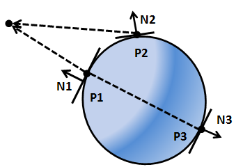

# 要有光（Let there be light）

在本章中，我们将学习如何为3D游戏引擎添加光照。我们不会去实现一个完美的光照模型，因为抛开复杂性不谈，它还需要消耗大量的计算机资源，相反我们只需要一个近似的、像样的光照效果：我们将使用名为 __Phong__ 的着色算法（由Bui Tuong Phong开发）。另一个需要注意的是，我们将只模拟光照，但不会模拟这些光照所产生的阴影（这将在后续章节中实现）。

在开始之前，先定义几个光照类型：

* **点光源（Point Light）**：这种光源模拟的是一个由点向空间各个方向均匀散射的光源。
* **聚光源（Spot Light）**：这种光源模拟从空间中的点发射的光源，但不是在所有方向上发射，而是限定在了一个锥形方向上。
* **平行光源（Directional Light）**：这种光源模拟了太阳光，3D场景中的所有物体都会受到来自特定方向的平行光线的照射。无论物体是近抑或是远，光线总是以一定角度照射在物体上的。
* **环境光（Ambient Light）**：这种类型的光源来自空间的任何地方，并以相同的强度照亮所有物体。


因此，为了模拟光照，我们需要考虑光照的类型、位置和其他一些参数，如颜色。当然，我们还必须考虑物体如何受光照影响吸收和反射光。

Phong着色算法将模拟光线对我们模型中每个点的影响，即对每个顶点的影响。这就是为什么它被称为局部光照模型的原因，这也是该算法不能计算阴影的原因：它只会计算应用到每个顶点的光照，而不考虑顶点是否位于遮光物体之后。我们将在此后的章节中解决这个问题。但正因如此，它是一种非常简单快速的算法，并且可以提供非常好的效果。我们将在此实现一个没有深入考虑材质影响的简化版本。

Phong算法提供了三种光照分量：

* **环境光（Ambient Light）**：模拟来自任何方向的光照，它将照亮（需要对应强度值）未受任何光线照射的区域，就像背景光。
* **漫反射（Diffuse Reflectance）**：考虑到面向光源的表面更亮。
* **镜面反射（Specular Reflectance）**：模拟光线在抛光或金属表面上的反射。

最后，我们要得到一个因数，将它与指定片元的颜色相乘，根据它所受的光照将该颜色变得更亮或更暗。令$A$为环境光、$D$为漫反射光、$S$为镜面反射光，目标因数将是上述分量的总和：

$$L = A + D + S$$

这些分量其实就是颜色，也就是每个光照分量所贡献的颜色分量。这是因为光照分量不仅会提供一定程度的亮度，还会改变模型的颜色。在我们的片元着色器中，只需将该光照的颜色与原始片元颜色（从纹理或基色获得的）相乘即可。

我们还可以为相同的材质指定不同的颜色，这些颜色将用于环境光、漫反射和镜面反射分量。因此，这些分量将由材质关联的颜色调整。如果材质有纹理，我们只需为每个分量使用一个纹理。

所以对于无纹理的材质的最终颜色将是：

$$L = A * 环境光的颜色 + D * 漫反射的颜色 + S * 镜面反射的颜色$$

对于有纹理的材质的最终颜色将是：

$$L = A * 纹理颜色 + D * 纹理颜色 + S * 纹理颜色$$

## 环境光分量

让我们来看看第一个分量，即环境光分量，它只是一个常量，会使我们的所有物体变得更亮或更暗。我们可以使用它来模拟一天中特定时间段内的光照（黎明、黄昏等），也可以用它来添加一些不直接被光线照射到，但可以以简单的方式被间接光线照射（比如反射）到的点的光照。

环境光是最容易计算的分量，我们只需要传递一种颜色，它将与基色相乘，以调整该基色。假如我们已经确定片元的颜色是$(1.0, 0.0, 0.0)$，即红色。如果没有环境光时，它将显示为完全红色的片元。如果我们将环境光设置为$(0.5, 0.5, 0.5)$，则最终颜色将为$(0.5, 0.0, 0.0)$，其实就是变暗的红色。这种光照会以相同的方式使所有片元变暗（称其为使物体变暗的光似乎有点奇怪，事实上这就是我们得到的效果）。此外，如果光色的RGB分量不相同，它还可以为片元添加一些颜色，所以我们只需要一个矢量来调节环境光强度和颜色。

## 漫反射

现在我们来谈谈漫反射，它模拟了这样一个现象：与光线垂直的面看起来比以更接近与光线平行的角度接收光线的面更亮。一个物体接收到的光越多，其光密度（在此这样称呼）就越高。


但是，我们该如何计算它？你还记得上一章中我们介绍过的法线的概念吗？法线是垂直于平面并且长度为1的向量。因此，让我们为上图中的三个点的绘制法线。如你所见，每个点的法线将是垂直于每个点的切平面的向量。我们不用绘制来自光源的光线，而是绘制从每个点到光源（即相反的方向）的向量。



如你所见，$P1$点的法线$N1$与指向光源的向量平行，该法线的方向与光线的方向相反（$N1$已被移动，以便你可以看到它，但这在数学上是等价的）。$P1$与指向光源的向量所成的夹角等于$0$。因为它的切平面垂直于光源，所以$P1$将是最亮的点。

$P2$点的法线$N2$与指向光源的向量所成的夹角约为30度，所以它应该比$P1$更暗。最后，$P3$的法线$N3$也与指向光源的向量平行，但两个向量的方向相反。$P3$与指向光源的向量的角度为180度，所以根本不应该接收到任何光线。

因此，我们似乎得到了一个计算某点的光照强度的好方法，光强与该点的法线和该点指向光源的向量之间的夹角大小有关。但我们要怎么计算它呢？

有一个我们可以使用的数学运算————数量积（又称为点积）。该运算需要两个向量并得到一个数字（标量），如果它们之间的角度较小，则得到一个正数；如果它们之间的角度很大，则得到一个负数。如果两个向量都被归一化，即两者的长度都等于1，那么数量积的结果将介于$-1$和$1$之间。如果两个向量的方向相同（即夹角为$0$），则数量积为1；如果两个向量夹角为直角，则它的值为$0$；如果两个向量的方向相反，则为$-1$。

我们定义两个向量，$v1$和$v2$，并以$α$作为它们之间的夹角。数量积的定义如下：


如果两个向量都归一化，即它们的长度，或它们的模长等于1，它们的数量积即为夹角的余弦值。我们将使用该运算来计算漫反射分量。

所以我们需要计算指向光源的向量，该怎么做呢？假如我们有每个点的位置（即顶点位置）和光源的位置。首先，这两个坐标必须位于同一个坐标空间中。为了简化，我们假设它们都处于世界坐标系中，那么这些位置是指向顶点位置（$VP$）和光源（$VS$）的向量的坐标，如下图所示：


如果我们从$VP$中减去$VS$，就会得到我们所需的向量，称为$L$。

现在，我们可以在指向光源的矢量和法线之间做数量积，因为Johann Lambert是第一个提出这种关系来模拟平面亮度的，所以该乘积被称为兰伯特项。

让我们总结一下，定义以下变量：

* $vPos$ ：我们的顶点在模型观察空间坐标系中的位置。
* $lPos$：观察空间坐标系中的光源位置。
* $intensity$：光的强度（从0到1）。
* $lCourour$：光的颜色。
* $normal$：顶点法线。

首先我们需要计算从当前位置指向光源的向量：$toLightDirection = lPos - vPos$，该运算的结果需要归一化。

然后我们需要计算漫反射因数（标量）：$diffuseFactor = normal \cdot toLightDirection$。计算两向量之间的数量积，我们希望值介于$-1$和$1$之间，所以两个向量都需要归一化。颜色需要介于$0$到$1$之间，所以如果值低于$0$，我们将其设为$0$。

最后，我们只需要通过漫反射因数和光的强度来调节光的颜色：

$$ color = diffuseColour * lColour * diffuseFactor * intensity$$

## 镜面反射

现在看到镜面反射，但首先我们需要知道光线是如何反射的。当光照射到一个表面时，它的一部分被吸收，另一部分被反射，如果你还记得你的物理课知识，反射就是光从物体反弹回来。


当然，物体表面不是完全抛光的，如果你仔细观察，你会看到很多不平整的地方。此外还有许多光线（实际上是光子），会撞击这个表面，并且会以不同的角度进行反射。因此，我们看到的就像是一束光照射表面并散射回来。也就是说，光在撞击表面时会发散，这就是我们之前讨论过的漫反射分量。


但是，当光线照射抛光表面时，例如金属，光线会受到较低的扩散影响，并且在它撞到表面时，大部分会向反方向反射。


这就是镜面反射分量的模型，它取决于材质属性。对于镜面反射，重要的是只有当摄像机处于恰当的位置时，即反射光的反射区域内，反射光才可见。


既然已经解释了镜面反射之中的机理，我们接下来准备计算这个分量。首先我们需要一个从光源指向顶点的向量。当我们计算漫反射分量时，我们使用的是方向与之相反的向量，它指向的是光源，即$toLightDirection$。所以让我们将其计算为$fromLightDirection = -(toLightDirection)$。

然后我们需要考虑到表面的法线，来计算由$fromLightDirection$射出的光线撞击表面所产生的反射光。有一个名为`reflect`的GLSL函数实现了该功能。所以，$reflectLight = reflect(fromLightSource, normal)$。

我们还需要一个指向摄像机的向量，并将其命名为$cameraDirection$，然后计算出摄像机位置和顶点位置之间的差值：$cameraDirection = cameraPos - vPos$。摄像机位置向量和顶点位置需要处于相同的坐标系中，并且得到的向量需要归一化。下图概述了我们目前计算的主要分量：


现在我们需要计算光强，即$specularFactor$。如果$cameraDirection$和$reflectLight$向量指向相同的方向，该值就越高，如果它们方向相反其值则越低。为了计算该值我们将再次运用数量积。$specularFactor = cameraDirection \cdot reflectLight$。我们只希望该值位于$0$和$1$之间，所以如果它低于$0$，就将它设为0。

我们还需要考虑到，如果摄像机指向反射光锥，则该光更强烈。这可以通过计算$specularFactor$的$specularPower$次幂来实现，其中$specularPower$为给定的参数：

$$specularFactor = specularFactor^{specularPower}$$

最后，我们需要对材质的反射率进行建模，如果光线反射，反射率将调节反射光的强度，这将用到一个名为`reflectance`的参数。所以镜面反射分量的颜色为：

$$specularColour * lColour * reflectance * specularFactor * intensity$$

## 衰减

我们现在知道如何计算这三个分量了，这些分量可以帮助我们用环境光模拟点光源。但是我们的光照模型还不完整，因为物体反射的光与光源的距离无关，也就是说，我们需要模拟光线衰减。

衰减是一个与距离和光有关的函数。光的强度与距离的平方成反比。这很容易理解，随着光线的传播，其能量沿着球体表面分布，其半径等于光线行进的距离，而球的表面积与其半径的平方成正比。我们可以用下式来计算衰减因子：$1.0 /(atConstant + atLineardist + atExponentdist ^ {2})$。

为了模拟衰减，我们只需要将衰减因数乘以最终颜色即可。

## 实现

现在我们可以开始编程实现上述的所有概念，我们将从着色器开始。大部分工作将在片元着色器中完成，但我们还需要将顶点着色器中的一些数据传递给它。在上一章中，片元着色器仅接收纹理坐标，现在我们还将传递两个参数：

* 已转换为模型观察空间坐标系并已归一化的顶点法线。
* 已转换为模型观察空间坐标系的顶点位置。

顶点着色器的代码如下所示：

```glsl
#version 330

layout (location=0) in vec3 position;
layout (location=1) in vec2 texCoord;
layout (location=2) in vec3 vertexNormal;

out vec2 outTexCoord;
out vec3 mvVertexNormal;
out vec3 mvVertexPos;

uniform mat4 modelViewMatrix;
uniform mat4 projectionMatrix;

void main()
{
    vec4 mvPos = modelViewMatrix * vec4(position, 1.0);
    gl_Position = projectionMatrix * mvPos;
    outTexCoord = texCoord;
    mvVertexNormal = normalize(modelViewMatrix * vec4(vertexNormal, 0.0)).xyz;
    mvVertexPos = mvPos.xyz;
}
```

在我们继续讲解片元着色器之前，必须强调一个非常重要的概念。从上述代码可以看到，`mvVertexNormal`，该变量包含已转换为模型观察空间坐标的顶点法线。这是通过将`vertexNormal`乘上`modelViewMatrix`来实现的，就像顶点位置一样。但有一个细微的区别，该顶点法线的w分量在乘以矩阵之前被设置为0：`vec4(vertexNormal, 0.0)`。我们为什么要这样做呢?因为我们希望法线被旋转和缩放，但我们不希望它被平移，所以我们只对它的方向感兴趣，而不是它的位置。而这是通过将w分量设置为0来实现的，这也是是使用齐次坐标的优点之一，通过设置w分量，我们可以控制应用的变换。你可以在纸上做矩阵乘法，看看为什么是这样。

现在我们可以开始在片元着色器中开工了，除了将来自顶点着色器的值声明为输入参数之外，我们将定义一些有用的结构体来建模光照和材质属性。首先我们定义用于建模光的结构体。

```glsl
struct Attenuation
{
    float constant;
    float linear;
    float exponent;
};

struct PointLight
{
    vec3 colour;
    // 光源位置是在观察坐标系中的
    vec3 position;
    float intensity;
    Attenuation att;
};
```

点光源由一个颜色，一个位置，以及一个介于$0$和$1$之间的数字（用于模拟光照强度）和一组用于模拟衰减方程的参数定义。

建模材质属性的结构体如下：

```glsl
struct Material
{
    vec4 ambient;
    vec4 diffuse;
    vec4 specular;
    int hasTexture;
    float reflectance;
};
```

材质由一组颜色定义（假如我们不使用纹理为片元着色）：

* 用于环境光分量的颜色。
* 用于漫反射分量的颜色。
* 用于镜面反射分量的颜色。

材质还由一个标志控制它是否拥有关联的纹理和反射率指数定义。我们将在片元着色器中使用以下Uniform。

```glsl
uniform sampler2D texture_sampler;
uniform vec3 ambientLight;
uniform float specularPower;
uniform Material material;
uniform PointLight pointLight;
uniform vec3 camera_pos;
```

我们用新建的Uniform设置以下变量：

* 环境光：储存颜色，以同样方式影响每个片元。
* 镜面反射强度（在讨论镜面反射光时给出的方程式中使用的指数）。
* 一个点光源。
* 材质属性。
* 摄像机在观察空间坐标系中的位置。

我们还将定义一些全局变量，它们将储存要在环境、漫反射和镜面反射中使用的材质颜色分量。我们使用这些变量是因为如果分量具有纹理，我们将对所有分量使用相同的颜色，并且我们不希望进行冗余的纹理查找。这些变量的定义如下：

```glsl
vec4 ambientC;
vec4 diffuseC;
vec4 speculrC;
```

我们现在可以定义一个函数，来根据材质属性设置这些变量：

```glsl
void setupColours(Material material, vec2 textCoord)
{
    if (material.hasTexture == 1)
    {
        ambientC = texture(texture_sampler, textCoord);
        diffuseC = ambientC;
        speculrC = ambientC;
    }
    else
    {
        ambientC = material.ambient;
        diffuseC = material.diffuse;
        speculrC = material.specular;
    }
}
```

现在我们要定义一个函数，它以点光源、顶点位置及其法线为输入并返回此前描述的漫反射和镜面反射分量计算的颜色。

```glsl
vec4 calcPointLight(PointLight light, vec3 position, vec3 normal)
{
    vec4 diffuseColour = vec4(0, 0, 0, 0);
    vec4 specColour = vec4(0, 0, 0, 0);

    // 漫反射
    vec3 light_direction = light.position - position;
    vec3 to_light_source  = normalize(light_direction);
    float diffuseFactor = max(dot(normal, to_light_source ), 0.0);
    diffuseColour = diffuseC * vec4(light.colour, 1.0) * light.intensity * diffuseFactor;

    // 镜面反射
    vec3 camera_direction = normalize(-position);
    vec3 from_light_source = -to_light_source;
    vec3 reflected_light = normalize(reflect(from_light_source, normal));
    float specularFactor = max( dot(camera_direction, reflected_light), 0.0);
    specularFactor = pow(specularFactor, specularPower);
    specColour = speculrC * specularFactor * material.reflectance * vec4(light.colour, 1.0);

    // 衰减
    float distance = length(light_direction);
    float attenuationInv = light.att.constant + light.att.linear * distance +
        light.att.exponent * distance * distance;
    return (diffuseColour + specColour) / attenuationInv;
}
```

上述代码相对比较直白简单，它只是计算了漫反射分量的颜色，另一个是计算镜面反射的颜色，并通过光线在到达我们正在处理的顶点时受到的衰减来调整它们。

请注意，顶点坐标是位于观察空间中的。在计算镜面反射时，我们得出到观察点（即摄像机位置）的方向，代码如下：

```glsl
 vec3 camera_direction = normalize(camera_pos - position);
```

但是，由于`position`位于观察空间中，摄像机位置始终位于原点，即$(0, 0, 0)$，所以我们按如下代码计算它：

```glsl
 vec3 camera_direction = normalize(vec3(0, 0, 0) - position);
```

可以简化为：

```glsl
 vec3 camera_direction = normalize(-position);
```

有了上述函数，顶点着色器的主函数就变得非常简单了。

```glsl
void main()
{
    setupColours(material, outTexCoord);

    vec4 diffuseSpecularComp = calcPointLight(pointLight, mvVertexPos, mvVertexNormal);

    fragColor = ambientC * vec4(ambientLight, 1) + diffuseSpecularComp;
}
```

调用`setupColours`函数将使用适当的颜色来设置变量`ambientC`、`diffuseC`和`speculrC`。然后，我们计算漫反射和镜面反射分量，并考虑到衰减。为了方便起见，我们使用单个函数调用来实现此操作，如上所述。最终的颜色是通过添加环境光分量来计算的（将`ambientC`乘以环境光）。如你所见，环境光不受衰减的影响。

在着色器中我们引入了一些需要进一步解释的新概念，我们正在定义结构体并将它们用作Uniform。但我们要怎么传递这些结构体？首先，我们将定义两个新类，它们建模点光源和材质属性，名为`PointLight`和`Material`。它们只是普通的Java对象，所以你可以在本书附带的源代码中查看它们。然后，我们需要在`ShaderProgram`类中创建新方法，首先要能够为点光源和材质结构体创建Uniform。

```java
public void createPointLightUniform(String uniformName) throws Exception {
    createUniform(uniformName + ".colour");
    createUniform(uniformName + ".position");
    createUniform(uniformName + ".intensity");
    createUniform(uniformName + ".att.constant");
    createUniform(uniformName + ".att.linear");
    createUniform(uniformName + ".att.exponent");
}

public void createMaterialUniform(String uniformName) throws Exception {
    createUniform(uniformName + ".ambient");
    createUniform(uniformName + ".diffuse");
    createUniform(uniformName + ".specular");
    createUniform(uniformName + ".hasTexture");
    createUniform(uniformName + ".reflectance");
}
```

如你所见，它非常简单，我们只为构成结构体的所有属性创建一个单独的Uniform。现在我们需要创建另外两个方法来设置这些Uniform的值，并将`PointLight`和`Material`的实例作为参数。

```java
public void setUniform(String uniformName, PointLight pointLight) {
    setUniform(uniformName + ".colour", pointLight.getColor() );
    setUniform(uniformName + ".position", pointLight.getPosition());
    setUniform(uniformName + ".intensity", pointLight.getIntensity());
    PointLight.Attenuation att = pointLight.getAttenuation();
    setUniform(uniformName + ".att.constant", att.getConstant());
    setUniform(uniformName + ".att.linear", att.getLinear());
    setUniform(uniformName + ".att.exponent", att.getExponent());
}

public void setUniform(String uniformName, Material material) {
    setUniform(uniformName + ".ambient", material.getAmbientColour());
    setUniform(uniformName + ".diffuse", material.getDiffuseColour());
    setUniform(uniformName + ".specular", material.getSpecularColour());
    setUniform(uniformName + ".hasTexture", material.isTextured() ? 1 : 0);
    setUniform(uniformName + ".reflectance", material.getReflectance());
}
```

在本章源代码中，你还将看到我们还修改了`Mesh`类来储存材质实例，并且创建了一个简单的示例，在其中创建了一个可用“N”和“M”键控制移动的点光源，以显示点光源聚焦在反射率值高于0的网格上时是怎样的。

让我们回到片元着色器，如上所述，我们需要另一个储存摄像机位置`camera_pos`的Uniform。这些坐标必须位于观察空间中。通常我们将在世界空间坐标系中设置光源坐标，因此我们需要将它们乘以观察矩阵，以便能够在着色器中使用它们，所以需要在`Transformation`类中创建一个新方法，该方法返回观察矩阵以便变换光源坐标。

```java
// 获得光源对象的副本并将它的坐标变换到观察空间坐标系
PointLight currPointLight = new PointLight(pointLight);
Vector3f lightPos = currPointLight.getPosition();
Vector4f aux = new Vector4f(lightPos, 1);
aux.mul(viewMatrix);
lightPos.x = aux.x;
lightPos.y = aux.y;
lightPos.z = aux.z; 
shaderProgram.setUniform("pointLight", currPointLight);
```

我们不会写上完整的源代码，因为如果这样这一章就太长了，且对于解释清楚概念没有太多的帮助，你可以在本书附带的源代码中查阅源代码。


