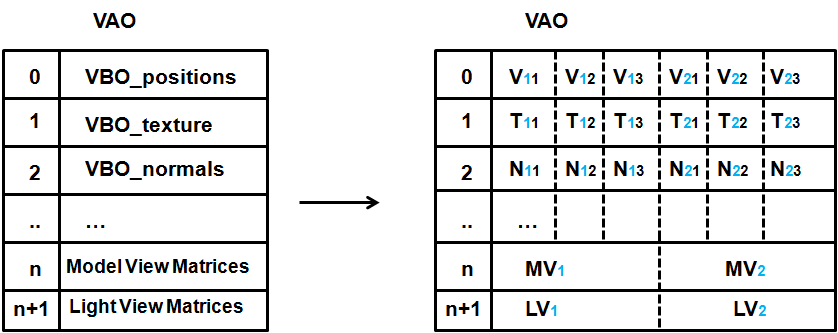
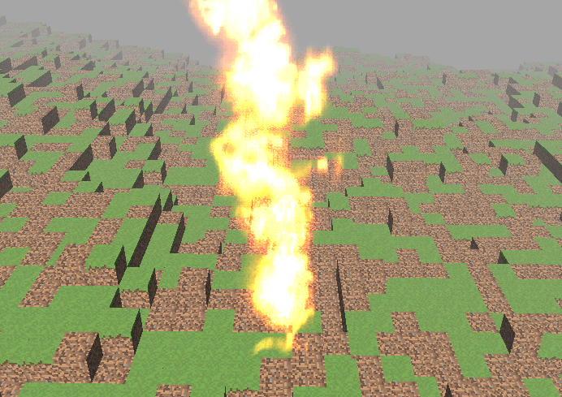

# 实例化渲染（Instanced Rendering）

## 很多实例

在绘制三维场景时，经常会有许多模型用相同的网格表示，但它们具有不同的变换。在此情况下，尽管它们可能是只有几个三角形的简单物体，但性能仍可能会受到影响，这背后的原因就是我们渲染它们的方式。

我们基本上是在循环中遍历所有游戏项，并对函数`glDrawElements`进行调用。如前几章所说的，对OpenGL库的调用应该最小化。对函数`glDrawElements`的每次调用都会造成一定开销。这对于每个`GameItem`实例会反复产生开销。

在处理大量相似物体时，使用一次调用渲染所有这些物体会更有效。这种技术被称为实例化渲染。为了实现同时渲染一组元素，OpenGL提供了一组名为`glDrawXXXInstanced`的函数。在本例中，由于我们正在绘制元素，所以将使用名为`glDrawElementsInstanced`的函数。该函数接收与`glDrawElements`相同的参数，外加一个额外的参数，用于设置要绘制的实例数。

这是一个如何使用`glDrawElements`的示例：

```java
glDrawElements(GL_TRIANGLES, numVertices, GL_UNSIGNED_INT, 0)
```

以下是实例化版本的用法:

```java
glDrawElementsInstanced(GL_TRIANGLES, numVertices, GL_UNSIGNED_INT, 0, numInstances);
```

但是你现在可能想知道，如何为每个实例设置不同的变换。现在，在绘制每个实例之前，我们将使用Uniform来传递不同的变换和实例相关的数据。在进行渲染调用之前，我们需要为每项设置特定的数据。当它们开始渲染时，我们如何做到这一点呢？

当使用实例化渲染时，在顶点着色器中我们可以使用一个输入变量来储存当前绘制实例的索引。例如，使用这个内置变量，我们可以传递一个包含要应用到每个实例的变换的Uniform数组，并仅做一次渲染调用。

这种方法的问题是，它仍然会带来太多的开销。除此之外，我们能够传递的Uniform数量是有限的。因此，需要使用另一种方法，而不是使用Uniform数组，我们将使用实例化数组。

如果你还记得前几章，每个网格的数据都是由一组名为VBO的数据数组定义的。这些VBO中的数据储存在每个唯一的`Mesh`实例中。


使用标准的VBO，在着色器中，我们可以访问与每个顶点（其位置、颜色、纹理等）相关的数据。无论何时运行着色器，输入变量都被设置为指向与每个顶点相关的指定数据。使用实例化数组，我们可以设置每个实例而不是每个顶点所更改的数据。如果我们将这两种类型结合起来，就可以使用常规的VBO来储存每个顶点的信息（坐标，纹理坐标）和用VBO储存每个实例的数据（如模型观察矩阵）。

下图展示了由三个顶点组成的网格，每个顶点定义了坐标、纹理与法线。每个元素的第一个索引是它所属的实例（蓝色）。第二个索引表示实例中的顶点位置。

网格也由两个实例VBO定义。一个用于模型观察矩阵，另一个用于光照观察矩阵。当为第一个实例渲染顶点（第1X个）时，模型观察矩阵和光照观察矩阵是相同的（第1个）。当渲染第二个实例的顶点时，将使用第二个模型观察矩阵和光照观察矩阵。



因此，在渲染第一个实例的第一个顶点时，将使用V11、T11和N11作为坐标、纹理和法线数据，并使用MV1作为模型观察矩阵。当渲染同一个实例的第二个顶点时，将使用V12、T12和N12作为坐标、纹理和法线数据，仍使用MV1作为模型观察矩阵。在渲染第二个实例之前，不会使用MV2和LV2。

为了定义每个实例数据，我们需要在顶点属性之后调用函数`glVertexAttribDivisor`。该函数接收两个参数：

* index：顶点属性的索引（在`glVertexAttribPointer`函数中设置的）。

* divisor: 如果这个值为0，那么在渲染时，每个顶点的数据都会改变。如果将其设置为1，则每渲染一个实例，数据更改一次。如果它被设置为2，则每渲染两个实例就会更改一次，以此类推。

因此，为了设置实例的数据，我们需要在每个属性定义之后进行如下调用：

```java
glVertexAttribDivisor(index, 1);
```

让我们开始修改代码库，以支持实例化渲染。第一步是创建一个名为`InstancedMesh`的新类，该类继承自`Mesh`类。该类的构造函数类似于`Mesh`的构造函数，但有一个额外的参数，即实例数。

在构造函数中，除了依赖超类的构造函数外，我们还将创建两个新的VBO，一个用于模型观察矩阵，另一个用于光照观察矩阵。创建模型观察矩阵的代码如下所示：

```java
modelViewVBO = glGenBuffers();
vboIdList.add(modelViewVBO);
this.modelViewBuffer = MemoryUtil.memAllocFloat(numInstances * MATRIX_SIZE_FLOATS);
glBindBuffer(GL_ARRAY_BUFFER, modelViewVBO);
int start = 5;
for (int i = 0; i < 4; i++) {
    glVertexAttribPointer(start, 4, GL_FLOAT, false, MATRIX_SIZE_BYTES, i * VECTOR4F_SIZE_BYTES);
    glVertexAttribDivisor(start, 1);
    start++;
}
```

The first thing that we do is create a new VBO and a new `FloatBuffer` to store the data on it. The size of that buffer is measured in floats, so it will be equal to the number of instances multiplied by the size in floats of a 4x4 matrix, which is equal to 16.

Once the VBO has been bond we start defining the attributes for it. You can see that this is done in a for loop that iterates four times. Each turn of the loop defines one vector the matrix. Why not simply defining a single attribute for the whole matrix? The reason for that is that a vertex attribute cannot contain more than four floats. Thus, we need to split the matrix definition into four pieces. Let’s refresh the parameters of the `glVertexAttribPointer`:

* Index: The index of the element to be defined.
* Size: The number of components for this attribute. In this case it’s 4, 4 floats, which is the maximum accepted value.
* Type: The type of data \(floats in our case\).
* Normalize: If fixed-point data should be normalized or not.
* Stride: This is important to understand here, this sets the byte offsets between consecutive attributes. In this case, we need to set it to the whole size of a matrix in bytes. This acts like a mark that packs the data so it can be changed between vertex or instances.
* Pointer: The offset that this attribute definition applies to. In our case, we need to split the matrix definition into four calls. Each vector of the matrix increments the offset.

After defining the vertex attribute, we need to call the `glVertexAttribDivisor` using the same index.

The definition of the light view matrix is similar to the previous one, you can check it in the source code. Continuing with the `InstancedMesh` class definition it’s important to override the methods that enable the vertex attributes before rendering \(and the one that disables them after\).

```java
@Override
protected void initRender() {
    super.initRender();
    int start = 5;
    int numElements = 4 * 2;
    for (int i = 0; i < numElements; i++) {
        glEnableVertexAttribArray(start + i);
    }
}

@Override
protected void endRender() {
    int start = 5;
    int numElements = 4 * 2;
    for (int i = 0; i < numElements; i++) {
        glDisableVertexAttribArray(start + i);
    }
    super.endRender();
}
```

The `InstancedMesh` class defines a public method, named `renderListInstanced`, that renders a list of game items, this method splits the list of game items into chunks of size equal to the number of instances used to create the `InstancedMesh`. The real rendering method is called `renderChunkInstanced` and is defined like this.

```java
private void renderChunkInstanced(List<GameItem> gameItems, boolean depthMap, Transformation transformation, Matrix4f viewMatrix, Matrix4f lightViewMatrix) {
    this.modelViewBuffer.clear();
    this.modelLightViewBuffer.clear();
    int i = 0;
    for (GameItem gameItem : gameItems) {
        Matrix4f modelMatrix = transformation.buildModelMatrix(gameItem);
        if (!depthMap) {
            Matrix4f modelViewMatrix = transformation.buildModelViewMatrix(modelMatrix, viewMatrix);
            modelViewMatrix.get(MATRIX_SIZE_FLOATS * i, modelViewBuffer);
        }
        Matrix4f modelLightViewMatrix = transformation.buildModelLightViewMatrix(modelMatrix, lightViewMatrix);
        modelLightViewMatrix.get(MATRIX_SIZE_FLOATS * i, this.modelLightViewBuffer);
        i++;
    }
    glBindBuffer(GL_ARRAY_BUFFER, modelViewVBO);
    glBufferData(GL_ARRAY_BUFFER, modelViewBuffer, GL_DYNAMIC_DRAW);
    glBindBuffer(GL_ARRAY_BUFFER, modelLightViewVBO);
    glBufferData(GL_ARRAY_BUFFER, modelLightViewBuffer, GL_DYNAMIC_DRAW);
    glDrawElementsInstanced(GL_TRIANGLES, getVertexCount(), GL_UNSIGNED_INT, 0, gameItems.size());
    glBindBuffer(GL_ARRAY_BUFFER, 0);
}
```

The method is quite simple, we basically iterate over the game items and calculate the model view and light view matrices. These matrices are dumped into their respective buffers. The contents of those buffers are sent to to the GPU and finally we render all of them with a single call to the `glDrawElementsInstanced` method.

Going back to the shaders, we need to modify the vertex shader to support instanced rendering. We will first add new input parameters for the model and view matrices that will be passed when using instanced rendering.

```glsl
layout (location=5) in mat4 modelViewInstancedMatrix;
layout (location=9) in mat4 modelLightViewInstancedMatrix;
```

As you can see, the model view matrix starts at location 5. Since a matrix is defined by a set of four attributes \(each one containing a vector\), the light view matrix starts at location 9. Since we want to use a single shader for both non instanced and instanced rendering, we will maintain the uniforms for model and light view matrices. We only need to change their names.

```glsl
uniform int isInstanced;
uniform mat4 modelViewNonInstancedMatrix;
…
uniform mat4 modelLightViewNonInstancedMatrix;
```

We have created another uniform to specify if we are using instanced rendering or not. In the case we are using instanced rendering the code is very simple, we just use the matrices from the input parameters.

```glsl
void main()
{
    vec4 initPos = vec4(0, 0, 0, 0);
    vec4 initNormal = vec4(0, 0, 0, 0);
    mat4 modelViewMatrix;
    mat4 lightViewMatrix;
    if ( isInstanced > 0 )
    {
        modelViewMatrix = modelViewInstancedMatrix;
        lightViewMatrix = modelLightViewInstancedMatrix;
        initPos = vec4(position, 1.0);
        initNormal = vec4(vertexNormal, 0.0);
    }
```

We don’t support animations for instanced rendering to simplify the example, but this technique can be perfectly used for this.   
Finally, the shader just set up appropriate values as usual.

```glsl
    vec4 mvPos = modelViewMatrix * initPos;
    gl_Position = projectionMatrix * mvPos;
    outTexCoord = texCoord;
    mvVertexNormal = normalize(modelViewMatrix * initNormal).xyz;
    mvVertexPos = mvPos.xyz;
    mlightviewVertexPos = orthoProjectionMatrix * lightViewMatrix * initPos;
    outModelViewMatrix = modelViewMatrix;
}
```

Of course, the `Renderer` has been modified to support the uniforms changes and to separate the rendering of non instanced meshes from the instanced ones. You can check the changes in the source code.

In addition to that, some optimizations have been added to the source code by the JOML author [Kai Burjack](https://github.com/httpdigest). These optimizations have been applied to the `Transformation` class and are summarized in the following list:

* Removed redundant calls to set up matrices with identity values.
* Use quaternions for rotations which are more efficient.
* Use specific methods for rotating and translating matrices which are optimized for those operations.


## 回顾粒子

With the support of instanced rendering we can also improve the performance for the particles rendering. Particles are the best use case for this.

In order to apply instance rendering to particles we must provide support for texture atlas. This can be achieved by adding a new VBO with texture offsets for instanced rendering. The texture offsets can be modeled by a single vector of tow floats, so there's no need to split the definition as in the matrices case.

```java
// Texture offsets
glVertexAttribPointer(start, 2, GL_FLOAT, false, INSTANCE_SIZE_BYTES, strideStart);
glVertexAttribDivisor(start, 1);
```

But, instead of adding a new VBO we will set all the instance attributes inside a single VBO. The next figure shows the concept. We are packing up all the attributes inside a single VBO. The values will change per each instance.


In order to use a single VBO we need to modify the attribute size for all the attributes inside an instance. As you can see from the code above, the definition of the texture offsets uses a  constant named  `INSTANCE_SIZE_BYTES`. This constant is equal to the size in bytes of two matrices \(one for the view model and the other one for the light view model\) plus two floats \(texture offesets\), which in total is 136. The stride also needs to be modified properly.

You can check the modifications in the source code.

The `Renderer` class needs also to be modified to use instanced rendering for particles and support texture atlas in scene rendering. In this case, there's no sense in support both types of rendering \(non instance and instanced\), so the modifications are simpler.

The vertex shader for particles is also straight froward.

```glsl
#version 330
layout (location=0) in vec3 position;
layout (location=1) in vec2 texCoord;
layout (location=2) in vec3 vertexNormal;
layout (location=5) in mat4 modelViewMatrix;
layout (location=13) in vec2 texOffset;
out vec2 outTexCoord;
uniform mat4 projectionMatrix;
uniform int numCols;
uniform int numRows;
void main()
{
    gl_Position = projectionMatrix * modelViewMatrix * vec4(position, 1.0);

    // Support for texture atlas, update texture coordinates
    float x = (texCoord.x / numCols + texOffset.x);
    float y = (texCoord.y / numRows + texOffset.y);
    outTexCoord = vec2(x, y);}
```

The results of this changes, look exactly the same as when rendering non instanced particles but the performance is much higher. A FPS counter has been added to the window title, as an option. You can play with instanced and non instanced rendering to see the improvements by yourself.


## Extra bonus

With all the infrastructure that we have right now, I've modified the rendering cubes code to use a height map as a base, using also texture atlas to use different textures. It also combines particles rendering. It looks like this.



Please keep in mind that there's still much room for optimization, but the aim of the book is guiding you in learning LWJGL and OpenGL concepts and techniques. The goal is not to create a full blown game engine \(an definitely not a voxel engine, which require a different approach and more optimizations\).

