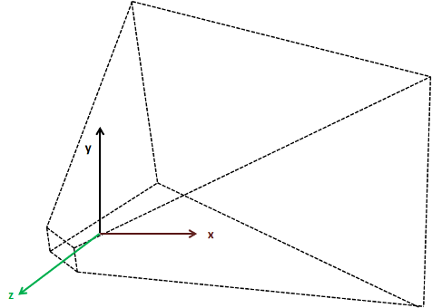
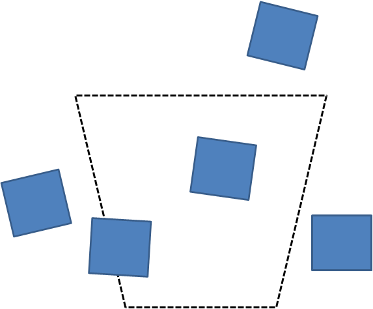
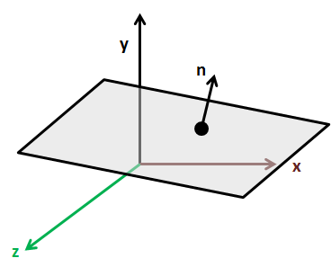
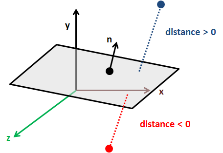
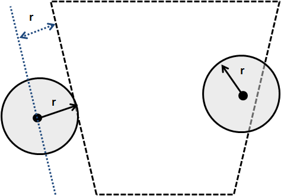

# 优化 - 截锥剔除 (Optimizations - Frustum Culling)

## 优化 - 截锥剔除一

现在我们使用了许多不同的图形效果，例如灯光、粒子等。此外，我们还学习了如何实例化渲染，以减少绘制许多相似对象的开销。然而，我们仍有足够的空间进行一些简单的优化，这将增加可以达到的帧率（FPS）。

你可能想知道为什么我们会在每一帧中绘制整个游戏项列表，即使其中一些项不可见（因为它们在摄像机后面或距离摄像机太远）。你甚至可能认为这是由OpenGL自动处理的，这在某种程度上是正确的。OpenGL将放弃位于可见区域之外的顶点的渲染，这称作裁剪（Clipping）。裁剪的问题是，在执行顶点着色之后，按顶点进行处理的。因此，即使此操作节省了资源，我们也可以通过不尝试渲染不可见的对象来提高效率。我们不会通过将数据发送到GPU以及对这些对象的每个顶点进行变换来浪费资源。我们需要移除不包含在视锥体（View Frustum）中的对象，也就是说，我们需要进行截锥剔除。

但是，首先让我们回顾一下什么是视锥体。视锥体是一个结合摄像机的位置和旋转以及使用的投影，包含所有可见物体的体积。通常，视锥体是一个四棱台，如下图所示：



如你所见，视锥体由六个平面定义，位于视锥体之外的任何内容都不会渲染。因此，截锥剔除是移除视锥体之外的对象的过程。

因此，为了进行截锥剔除，我们需要：

* 使用观察和投影矩阵中包含的数据计算截锥平面。

* 对每个游戏项检查它是否包含在视锥体中，换句话说，在大小截锥平面之间。并从渲染流程中删除那些不包含在其中的。



那么让我们从计算截锥平面开始。平面由包含在其中的点和与该平面正交的向量定义，如下图所示：



平面方程的定义如下：

$$Ax+By+Cz+D=0$$

因此，我们需要计算视锥体的六个侧面的六个平面方程。为了达成这个目标，你基本上有两个选项。你可以进行繁琐的计算，得到六个平面方程的来自上述方程的四个常数（A、B、C和D）。另一个选项是让[JOML](https://github.com/JOML-CI/JOML "JOML")库为你计算这个值。通常情况下，我们选择后一个选项。

让我们开始编码吧。我们将创建一个名为`FrustumCullingFilter`的新类，跟它的名字相同，它将根据视锥体执行筛选操作。

```java
public class FrustumCullingFilter {

    private static final int NUM_PLANES = 6;

    private final Matrix4f prjViewMatrix;

    private final Vector4f[] frustumPlanes;

    public FrustumCullingFilter() {
        prjViewMatrix = new Matrix4f();
        frustumPlanes = new Vector4f[NUM_PLANES];
        for (int i = 0; i < NUM_PLANES; i++) {
            frustumPlanes[i] = new Vector4f();
        }
    }
```

`FrustumCullingFilter`类也将有一个方法来计算平面方程，名为`updateFrustum`，它将在渲染之前调用。方法定义如下：

```java
public void updateFrustum(Matrix4f projMatrix, Matrix4f viewMatrix) {
    // 计算投影观察矩阵
    prjViewMatrix.set(projMatrix);
    prjViewMatrix.mul(viewMatrix);
    // 获取视锥体平面
    for (int i = 0; i < NUM_PLANES; i++) {
        prjViewMatrix.frustumPlane(i, frustumPlanes[i]);
    }
}
```

首先，我们储存投影矩阵的副本，并将其与观察矩阵相乘，得到投影观察矩阵。然后，使用这个变换矩阵，我们只需要为每个截锥平面调用`frustumPlane`方法。需要注意的是，这些平面方程是用世界坐标表示的，所以所有的计算都要在这个空间中进行。

现在我们已经计算了所有平面，我们只需要检查`GameItem`实例是否在截锥体中。该怎么做？让我们首先确认一下如何检查一个点是否在截锥体内，可以通过计算点到每个平面的有符号的距离来实现这一点。如果点到平面的距离是正的，这意味着点在平面的前面（根据其法线）。如果是负的，则意味着点在平面的后面。



因此，如果到截锥的所有平面的距离为正，则一个点位于视锥体的内部。点到平面的距离定义如下：

$距离=Ax_{0}+By_{0}+Cz_{0}+D$，其中$x_{0}$、$y_{0}$和$z_{0}$是点的坐标。

因此，如果$Ax_{0}+By_{0}+Cz_{0}+D <= 0$则点在平面的后面。

但是，我们没有点，只有复杂的网格，我们不能仅仅用点来检查一个物品是否在截锥体内。你可以考虑检查`GameItem`的每个顶点，看看它是否在截锥体内。如果任何一个点在里面，游戏项应该被绘制出来。但这就是OpenGL在裁剪时所做的，也是我们要避免的。记住，网格越复杂，截锥剔除的好处越明显。

我们需要把每一个`GameItem`放到一个简单的体中，这个体很容易检查。这里我们有两个选项：

* 边界盒（Bounding Box）。

* 边界球（Bounding Sphere）。

在本例中，我们将使用球体，因为这是最简单的方法。我们将把每一个游戏项放在一个球体中，并检查球体是否位于视锥体中。为了做到它，我们只需要球体的中心和半径。检查它几乎等同于检查点，但是我们需要考虑板甲。如果满足以下条件，则球体将位于截锥之外：$距离=Ax_{0}+By_{0}+Cz_{0} <= -半径$。



因此，我们将在`FrustumCullingFilter`类中添加一个新方法来检查球体是否在截锥中。方法的定义如下：

```java
public boolean insideFrustum(float x0, float y0, float z0, float boundingRadius) {
    boolean result = true;
    for (int i = 0; i < NUM_PLANES; i++) {
        Vector4f plane = frustumPlanes[i];
        if (plane.x * x0 + plane.y * y0 + plane.z * z0 + plane.w <= -boundingRadius) {
            result = false; return result;
        }
    }
    return result;
}
```

然后，我们将添加过滤视锥体外的游戏项的方法：

```java
public void filter(List<GameItem> gameItems, float meshBoundingRadius) {
    float boundingRadius;
    Vector3f pos;
    for (GameItem gameItem : gameItems) {
        boundingRadius = gameItem.getScale() * meshBoundingRadius;
        pos = gameItem.getPosition();
        gameItem.setInsideFrustum(insideFrustum(pos.x, pos.y, pos.z, boundingRadius));
    }
}
```

我们在`GameItem`类中添加了一个新的属性`insideFrustum`来跟踪可见性。如你所见，边界球的板甲作为参数传递。这是由于边界球与`Mesh`管理，它不是`GameItem`的属性。但是，请记住，我们必须在世界坐标中操作，并且边界球的半径将在模型空间震。我们将应用为`GameItem`设置的比例将其转换为世界空间，我们还假设`GameItem`的位置是球体的中心（在世界空间坐标系中）。

最后一个方法只是一个实用方法，它接受网格表并过滤其中包含的所有`GameItem`实例：

```java
public void filter(Map<? extends Mesh, List<GameItem>> mapMesh) {
    for (Map.Entry<? extends Mesh, List<GameItem>> entry : mapMesh.entrySet()) {
        List<GameItem> gameItems = entry.getValue();
        filter(gameItems, entry.getKey().getBoundingRadius());
    }
}
```

就这样。我们可以在渲染流程中使用该类，只需要更新截锥平面，计算出哪些游戏项是可见的，并在绘制实例网格和非实例网格时过滤掉它们：

```java
frustumFilter.updateFrustum(window.getProjectionMatrix(), camera.getViewMatrix());
frustumFilter.filter(scene.getGameMeshes());
frustumFilter.filter(scene.getGameInstancedMeshes());
```

你可以启用或禁用过滤功能，并可以检查你可以达到的FPS的增加和减少。在过滤时不考虑粒子，但是添加它是很简单的。对于粒子，在任何情况下最好检查发射器的位置，而不是检查每个粒子。

# 优化 - 截锥剔除二

解释了截锥剔除的基础，我们可以使用[JOML](https://github.com/JOML-CI/JOML "JOML")库中提供的更精细的方法。它特别地提供了一个名为`FrustumIntersection`的类，该类以按此[文章](http://gamedevs.org/uploads/fast-extraction-viewing-frustum-planes-from-world-view-projection-matrix.pdf "paper")所述的一种更有效的方式获取视锥体的平面。除此之外，该类还提供了测试边界盒、点和球体的方法。

那么，让我们修改`FrustumCullingFilter`类。属性和构造函数简化如下：

```java
public class FrustumCullingFilter {

    private final Matrix4f prjViewMatrix;

    private FrustumIntersection frustumInt;

    public FrustumCullingFilter() {
        prjViewMatrix = new Matrix4f();
        frustumInt = new FrustumIntersection();
    }
```

`updateFrustum`方法只是将平面获取委托给`FrustumIntersection`实例：

```java
public void updateFrustum(Matrix4f projMatrix, Matrix4f viewMatrix) {
    // 计算投影识图矩阵
    prjViewMatrix.set(projMatrix);
    prjViewMatrix.mul(viewMatrix);
    // 更新截锥相交类
    frustumInt.set(prjViewMatrix);
}
```

`insideFrustum`方法更简单：

```java
public boolean insideFrustum(float x0, float y0, float z0, float boundingRadius) {
    return frustumInt.testSphere(x0, y0, z0, boundingRadius);
}
```

使用该方法，你甚至可以达到更高的FPS。此外，还向`Window`类中添加了一个全局标记，以启用或禁用截锥剔除。`GameItem`类也有启用或禁用过滤的标记，因为对于某些项，截锥剔除过滤可能没有意义。
