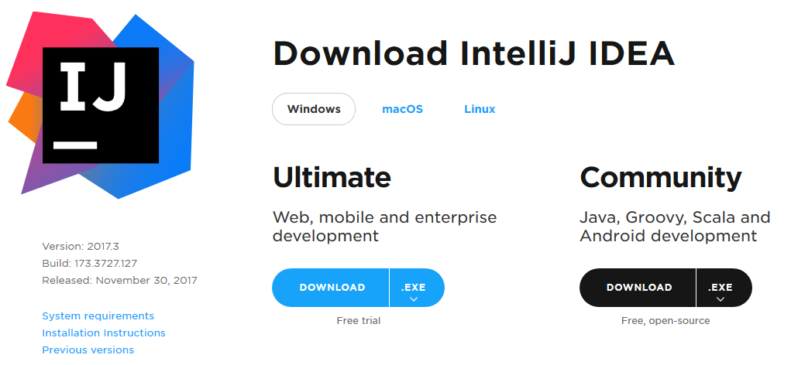
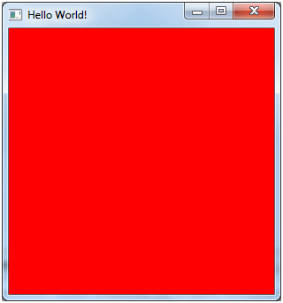

# 事前准备（First Steps）

在本书中，我们将学习开发3D游戏所涉及的主要技术。本书将使用Java语言和Java轻量级游戏库([LWJGL](http://www.lwjgl.org/))来编写示例代码。LWJGL库允许我们访问底层的API（应用程序接口），例如OpenGL。

LWJGL是一个底层的API，它像一个OpenGL包装库。如果你是想在短时间内开始制作一个3D游戏，那么也许你该考虑别的选择，比如使用引擎[JmonkeyEngine]。使用LWJGL这个底层API，在你看到效果之前，你需要了解许多概念并且编写大量的代码。这样做的好处是你可以更好的理解3D图形渲染，并且可以更好的控制它。

在前文我们说过在本书中我们将使用Java。更确切来说我们将使用Java 10，所以你需要从Oracle的页面下载对应版本的JDK。 请选择适合你的操作系统的安装程序。本书假定你对Java语言有一定的了解。

如果你需要一个可以运行示例代码的Java IDE（集成开发环境），你可以下载为Java 10提供良好支持的IntelliJ IDEA。 由于Java 10仅支持64位的平台，记得下载64位版本的IntelliJ。IntelliJ提供有一个免费且开源的社区版，你可以在这里下载它： [https://www.jetbrains.com/idea/download/](https://www.jetbrains.com/idea/download/ "Intellij").



为了构建我们的示例代码，我们将使用[Maven](https://maven.apache.org/)。Maven已经集成在大多数IDE中，你可以在IDE中直接打开不同章节的示例代码。只要打开了示例代码的文件夹，IntelliJ就会检测到它是一个Maven项目。


Maven基于一个名为`pom.xml`（Project Object Model，项目对象模型）的XML文件来构建项目，它管理了项目的依赖（需要使用的库）和在构建过程中需要执行的步骤。Maven遵循约定高于配置的原则，即如果你遵守标准的项目结构和命名约定，就不需要在配置文件中明确地声明源文件在哪里或者应该在哪里编译类。

本书不是一个Maven教程，如果有需要，请在网上搜索Maven的相关资料。源代码文件夹定义了一个父项目，它声明需要使用的插件并且声明需要使用的库的版本。

LWJGL 3.1 有了一些在项目构建上的改变。现在，它变得更加模块化，我们可以有选择的使用类库，而不是导入一个巨大的Jar文件。
但这是有代价的：你需要仔细地逐个指定依赖关系。不过[LWJGL下载](https://www.lwjgl.org/download)页面提供了一个为您生成POM文件的脚本。在我们的示例中，我们将只使用GLFW和OpenGL。你可以在源代码中查看我们的POM文件。

LWJGL平台依赖库已经可以为你的操作系统自动解压本地库，因此不需要使用其他插件（例如`mavennatives`）。我们只需要配置三个Profile来设置LWJGL所处的操作系统。Profile将会为Windows、Linux和Mac OS系列设置正确的属性值。

```xml
    <profiles>
        <profile>
            <id>windows-profile</id>
            <activation>
                <os>
                    <family>Windows</family>
                </os>
            </activation>
            <properties>
                <native.target>natives-windows</native.target>
            </properties>                
        </profile>
        <profile>
            <id>linux-profile</id>
            <activation>
                <os>
                    <family>Linux</family>
                </os>
            </activation>
            <properties>
                <native.target>natives-linux</native.target>
            </properties>                
        </profile>
        <profile>
            <id>OSX-profile</id>
            <activation>
                <os>
                    <family>mac</family>
                </os>
            </activation>
            <properties>
                <native.target>natives-osx</native.target>
            </properties>
        </profile>
    </profiles>
```

在每一个项目中，LWJGL平台依赖项将使用当前操作系统指定的配置中的属性值。

```xml
        <dependency>
            <groupId>org.lwjgl</groupId>
            <artifactId>lwjgl-platform</artifactId>
            <version>${lwjgl.version}</version>
            <classifier>${native.target}</classifier>
        </dependency>
```

此外，每个项目生成一个可运行的Jar（一种可以通过输入`java -jar name_of_the_jar.jar`就可运行的Jar）。这是通过使用Maven的`maven-jar-plugin`插件实现的，该插件创建了一个含有`MANIFEST.MF`文件的Jar，并且文件内有指定的值。该文件最重要的属性就是`Main-Class`，它指明了程序的入口。此外，所有的依赖库都被设置在该文件的`Class-Path`属性中。要在另一台计算机上运行它，你只需要复制位于目标目录下的主Jar文件和Lib目录（包括其中所有的Jar文件）。

Jar文件包含着LWJGL类和本地库。LWJGL还将负责提取它们，并将它们添加到JVM的库路径中。

本章的源代码是LWJGL网站([http://www.lwjgl.org/guide](http://www.lwjgl.org/guide))的入门示例，你可以看到我们没有使用Swing或JavaFX作为我们的GUI库。我们使用的是[GLFW](www.glfw.org)，它是一个用来处理GUI组件（窗口等）和事件（按键按下、鼠标移动等），并且与OpenGL上下文进行简单连接的库。此前版本的LWJGL提供了一个自定义GUI API，但在LWJGL 3中，GLFW是首选的窗口API。

示例源码是简单的并且有着良好的文档，所以我们不会在书中再次说明。

如果你正确地配置了环境，你应该能够运行它并且看到一个有着红色背景的窗口。



**本书中源代码发布于 [**GitHub**](https://github.com/lwjglgamedev/lwjglbook)**。
