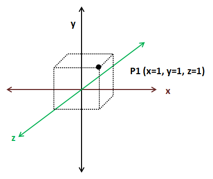
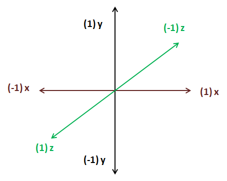

# 坐标简介（A brief about coordinates）

本章节中我们将讨论坐标和坐标系（coordinate system），尝试以简单的方式介绍一些基本的数学概念，为后面章节将要介绍的技术和内容提供帮助。我们将一些内容简化，为了易于学习而牺牲准确性。

我们通过指定坐标来确定物体在空间中的位置。想想地图。通过在地图上指定纬度和经度来确定一个点。只需一对数字，就可以精确的确认一个点。这对数字就是点坐标（实际上有些复杂，因为地图是一个不完美的椭圆球体（地球是不完美的椭圆球体）的投影，所以需要更多的数据，但这是一个很好的类比）

坐标系是一个系统，它使用一个或多个数字，即一个或多个坐标来唯一地指定一个点的位置。存在着多种不同的坐标系（如笛卡尔坐标系，极坐标系等），并且可以将坐标从一个坐标系转换到另一个坐标系。我们将使用笛卡尔坐标系。

在笛卡尔坐标系中，对于二维，坐标由两个数字定义，它们表示到两个相互垂直的X、Y轴的距离。

 

继续类比地图，坐标系定义一个原点。对于地理坐标，原点被设置为赤道和零度经线交叉的点。根据我们原点设置的位置，特定点的坐标是不同的。坐标系也可以定义轴的方向。在上图中，X坐标随着点向右移动而增加，Y坐标随着点向上移动而增加。但是，我们也可以定义一个与笛卡尔坐标系不同的，具有不同的轴取向的坐标系，我们将得到不同的坐标。
 

正如你所看到的那样，我们需要定义一些参数，例如原点和轴方向，以便给构成坐标的数字对给出适当的含义。为了使用一组坐标，我们必须使用对应的坐标系。好消息是我们可以通过平移和旋转来将坐标从一个坐标系转换到另一个坐标系。

如果我们要处理三维坐标，我们需要增加一个轴，即Z轴。三维坐标将由三个数字(x, y, z)构成。
 

在二维笛卡尔坐标系中，只要轴相互垂直，我们就可以改变三维坐标系中的轴的方向。下图展示了另一个三维坐标系。
 

三维坐标可分为左手系和右手系两种类型。你怎么知道它是什么类型的？用你的手在你的拇指和食指之间形成一个“L”，中指应指向垂直于其他两个手指的方向。拇指应该指向X轴的正方向，食指应该指向Y轴的正方向，而中指应该指向Z轴的正方向。如果你能用左手做到，那么它就是左手系，如果你需要用右手，那它就是右手系。

 

二维坐标系是相同的，因为通过旋转，我们可以从一个坐标系转换到另一个坐标系。但是，三维坐标系并不都是相同的。如果它们可以使用相同的手来表示，也就是说，如果两者都是左手系或者右手系，那么就能通过旋转一个坐标系到另一个坐标系。

现在我们已经确定了一些基本的概念，让我们来讲解一些在处理三维图形时常用的术语。当我们在之后的章节中解释如何渲染三维模型时，我们将看到我们使用不同的三维坐标系，这是因为每个坐标系都有不同的设定，不同的目的。一组坐标是没有意义的，除非明确它是某个坐标系的坐标。当你看到这个坐标(40.438031, -3.676626)时，你可能会有一个大胆的想法。但是如果我说他们是几何坐标（经度和纬度），你就会发现它们是马德里某个地方的坐标。

当我们加载三维物体时，我们将得到一组三维坐标。这些坐标在被称为物体坐标系（object coordinate space）的三维坐标系中表达。当建模师在设计这些三维模型的时候，他们对该模型将显示的三维场景毫不知情，因此只能使用与模型相关的坐标系来定义坐标。

当我们将绘制一个三维场景时，我们所有的三维物体将与被称为世界的坐标系对应。我们需要将三维物体的坐标系转换到世界坐标系。一些物体需要旋转、拉伸、放大和转换，以便在三维场景中能够正确地显示。

我们还需要限制所显示的三维空间的范围，例如移动摄像机穿梭在我们的三维空间中。然后我们需要将世界坐标转换成摄像机或视口坐标。最后，这些坐标需要转换为二维的屏幕坐标，所以我们需要将三维视图坐标投影到二维屏幕坐标系。

下面的图片展示了OpenGL坐标系（Z轴垂直于屏幕），坐标在-1和+1之间。

 

如果你不能清晰的理解这些概念，别担心。在下一章节中，它们将用实例表现出来。
