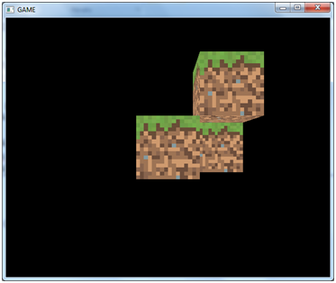

# 镜头（Camera）

在这个章节我们将学到如何渲染3D场景的画面，这个能力就像一个镜头可以在3D世界穿梭，然而实际上是用来说明他的一种编程语言。

但是如果你尝试在OpenGL寻找中这些特定的镜头功能，你会发现这根本不是镜头，换句话说镜头一直是固定住的，以屏幕\(0, 0, 0\)的位置为中心点

之所以这样，我们应该模拟出一个镜头可以在三维度空间中移动的镜头。但是如何做到呢？但是镜头是不能移动的我们必须要移动全部的实体在我们的3D世界中。换句话说，如果移动不了镜头我们得移动整个世界。

因此，假设我们沿着Z轴移动镜头从\(Cx, Cy, Cz\)到\(Cx, Cy, Cz+dz\)，从而靠近在\(Ox, Oy, Oz\)放置的目标


我们将要做的是如何精确的移动镜头移动到相反的方向\(在我们的3D空间中的所有物体\)。想想看，其实就像物体在跑步机上跑步一样。


镜头可以沿着三个轴\(x, y and z\)，也可以沿着他们旋转\(滚动, 俯视和偏斜"yaw"\).


所以从基本上我们必须做的就是让移动和旋转对于我们所设置的3D世界全部实体。我们应该怎么做捏？答案是用另外一种转化方法，把他变化所有在镜头运动方向上相反的顶点，从而根据镜头的旋转进而旋转他们。当然，这将要用另外一个矩阵，所谓的视图矩阵来完成。这个矩阵首先执行平移，然后沿着轴线进行旋转。

让我们看看如何构造这个矩阵。如果你记得变化章节（第6章）的转换方程式这样的:

$$Transf = \lbrack ProjMatrix \rbrack \cdot \lbrack TranslationMatrix \rbrack \cdot \lbrack  RotationMatrix \rbrack \cdot \lbrack  ScaleMatrix \rbrack = \lbrack   ProjMatrix \rbrack  \cdot \lbrack  WorldMatrix \rbrack$$

在这投影的相乘矩阵之前，应该先应用视图矩阵，之后我们的方程式应该是这样的：

$$Transf = \lbrack  ProjMatrix \rbrack \cdot \lbrack  ViewMatrix \rbrack \cdot \lbrack  TranslationMatrix \rbrack \cdot \lbrack  RotationMatrix \rbrack \cdot \lbrack ScaleMatrix \rbrack = \lbrack ProjMatrix \rbrack \cdot \lbrack  ViewMatrix \rbrack \cdot \lbrack  WorldMatrix \rbrack $$

现在有三个矩阵，我们应该思考一下这些矩阵的生命的周期。在我们的游戏运行的时候，投影矩阵不应该改变的太多，在情况最不好的时候，每个渲染都要调用才可能改变一次。如果镜头移动，则视图矩阵可以在每一次渲染改变一次。视图矩阵每`GameItem`项改变一次，所以每次渲染调用都会改变许多次。

因此，如何把每一个矩阵推到顶点着色器呢？您可能会看到一些代码，使用三个统一的每一个矩阵，但原则上，最有效的方法是结合投影和视图矩阵，我们称之为`PV`矩阵，并推动`world`和`PV`矩阵到我们的着色器。通过这种方法，我们将有可以与世界坐标一起进行并且可以避免一些额外的运算。

实际上，最方便的方法是将视图与世界矩阵相结合。为什么会这样？因为要记住整个镜头的概念就是戏法，但要做的是推动整个世界来模拟世界的位移和只显示一小部分的3D世界。因此，如果直接联合世界坐标一起工作，这样可能会引起远离中心点的世界坐标系，会遇到一些精度的问题。如果在所谓的镜头空间中工作利用点的性质，虽然远离世界的中心点，但也靠近镜头。可以将视图和世界矩阵相结合的矩阵通常被称为模型视图矩阵。

让我们开始修改代码来支持镜头。首先，先创建一个新的类，称为`Camera`，它将确保持相机的位置与旋转的方向。该类将提供新位置或旋转方向\(`setPosition` or `setRotation`\)的方法，或在当前状态\(`movePosition` and `moveRotation`\)上用偏移量更新这些值。


```java
package org.lwjglb.engine.graph;

import org.joml.Vector3f;

public class Camera {

    private final Vector3f position;

    private final Vector3f rotation;

    public Camera() {
        position = new Vector3f(0, 0, 0);
        rotation = new Vector3f(0, 0, 0);
    }

    public Camera(Vector3f position, Vector3f rotation) {
        this.position = position;
        this.rotation = rotation;
    }

    public Vector3f getPosition() {
        return position;
    }

    public void setPosition(float x, float y, float z) {
        position.x = x;
        position.y = y;
        position.z = z;
    }

    public void movePosition(float offsetX, float offsetY, float offsetZ) {
        if ( offsetZ != 0 ) {
            position.x += (float)Math.sin(Math.toRadians(rotation.y)) * -1.0f * offsetZ;
            position.z += (float)Math.cos(Math.toRadians(rotation.y)) * offsetZ;
        }
        if ( offsetX != 0) {
            position.x += (float)Math.sin(Math.toRadians(rotation.y - 90)) * -1.0f * offsetX;
            position.z += (float)Math.cos(Math.toRadians(rotation.y - 90)) * offsetX;
        }
        position.y += offsetY;
    }

    public Vector3f getRotation() {
        return rotation;
    }

    public void setRotation(float x, float y, float z) {
        rotation.x = x;
        rotation.y = y;
        rotation.z = z;
    }

    public void moveRotation(float offsetX, float offsetY, float offsetZ) {
        rotation.x += offsetX;
        rotation.y += offsetY;
        rotation.z += offsetZ;
    }
}
```

下一步 `Transformation` 到类中，将用一个新矩阵来保存视图矩阵的数值。

```java
private final Matrix4f viewMatrix;
```

我们将要提供一种更新这个值的方法。与投影矩阵一样，这个矩阵对于渲染周期中要渲染的所面对的对象都是相同的。

```java
public Matrix4f getViewMatrix(Camera camera) {
    Vector3f cameraPos = camera.getPosition();
    Vector3f rotation = camera.getRotation();

    viewMatrix.identity();
    // First do the rotation so camera rotates over its position
    viewMatrix.rotate((float)Math.toRadians(rotation.x), new Vector3f(1, 0, 0))
        .rotate((float)Math.toRadians(rotation.y), new Vector3f(0, 1, 0));
    // Then do the translation
    viewMatrix.translate(-cameraPos.x, -cameraPos.y, -cameraPos.z);
    return viewMatrix;
}
```

正如你所看到的，我们首先需要做旋转，然后翻译。如果我们做相反的事情，我们不会沿着镜头位置旋转，而是沿着坐标原点旋转。请注意，在`Camera`类的`movePosition`方法中，我们不只是简单地增加相机位置的偏移量。我们还考虑了沿Y轴的旋转，偏航，以便计算最终位置。如果我们只是通过偏移来增加相机的位置，相机就不会朝着它的方向移动。


正如你所看到的，我们首先需要做旋转，然后翻译。如果我们做相反的事情，我们不会沿着镜头位置旋转，而是沿着坐标原点旋转。请注意，在“镜头”类的“移动位置”方法中，我们不只是简单地增加相机位置的偏移量。我们还考虑了沿Y轴的旋转，偏航，以便计算最终位置。如果我们只是通过偏移来增加相机的位置，相机就不会朝着它的方向移动。 

除了上面提到的，我们这里没有一个完全自由移动的镜头\(例如，如果我们沿着X轴旋转，当我们向前移动时，镜头不会在空中向上或向下移动\)。这将在后面的章节中完成，因为这有点复杂。 

最后，我们将删除以前的方法`getWorldMatrix`，并添加一个新的名为`getModelViewMatrix`的方法。 

```java
public Matrix4f getModelViewMatrix(GameItem gameItem, Matrix4f viewMatrix) {
    Vector3f rotation = gameItem.getRotation();
    modelViewMatrix.identity().translate(gameItem.getPosition()).
        rotateX((float)Math.toRadians(-rotation.x)).
        rotateY((float)Math.toRadians(-rotation.y)).
        rotateZ((float)Math.toRadians(-rotation.z)).
        scale(gameItem.getScale());
    Matrix4f viewCurr = new Matrix4f(viewMatrix);
    return viewCurr.mul(modelViewMatrix);
}
```


这个`getModelViewMatrix`方法将在每个`GameItem`实例中调用，因此我们必须对视图矩阵的副本进行处理，因此在每次调用中都不会积累转换\(记住`Matrix4f`类不是不可变的\).


在`Renderer`类的`render`方法中，在投影矩阵更新之后，我们只需要根据镜头的更新视图矩阵的值，。

```java
// Update projection Matrix
Matrix4f projectionMatrix = transformation.getProjectionMatrix(FOV, window.getWidth(), window.getHeight(), Z_NEAR, Z_FAR);
shaderProgram.setUniform("projectionMatrix", projectionMatrix);

// Update view Matrix
Matrix4f viewMatrix = transformation.getViewMatrix(camera);

shaderProgram.setUniform("texture_sampler", 0);
// Render each gameItem
for(GameItem gameItem : gameItems) {
    // Set model view matrix for this item
    Matrix4f modelViewMatrix = transformation.getModelViewMatrix(gameItem, viewMatrix);
    shaderProgram.setUniform("modelViewMatrix", modelViewMatrix);
    // Render the mes for this game item
    gameItem.getMesh().render();
}
```

就是这样对于基本代码支持镜头的概念。现在我们需要用它。这样可以改变输入处理和更新相机的方式。我们将设置以下控件：

* 键“A”和“D”到移动镜头的左边和右边\(x axis\)。
* 键“W”和“S”到移动镜头的前面和后面\(z axis\)。
* 键“Z”和“X”到移动镜头的上面和下面的\(y axis\)。


当鼠标按下右键时，我们可以使用鼠标位置沿X和Y轴旋转镜头。 
正如你所看到的，我们将首次使用鼠标。我们将创建一个名为`MouseInput`的新类，该类将封装鼠标访问的代码。 

```java
package org.lwjglb.engine;

import org.joml.Vector2d;
import org.joml.Vector2f;
import static org.lwjgl.glfw.GLFW.*;

public class MouseInput {

    private final Vector2d previousPos;

    private final Vector2d currentPos;

    private final Vector2f displVec;

    private boolean inWindow = false;

    private boolean leftButtonPressed = false;

    private boolean rightButtonPressed = false;

    public MouseInput() {
        previousPos = new Vector2d(-1, -1);
        currentPos = new Vector2d(0, 0);
        displVec = new Vector2f();
    }

    public void init(Window window) {
        glfwSetCursorPosCallback(window.getWindowHandle(), (windowHandle, xpos, ypos) -> {
            currentPos.x = xpos;
            currentPos.y = ypos;
        });
        glfwSetCursorEnterCallback(window.getWindowHandle(), (windowHandle, entered) -> {
            inWindow = entered;
        });
        glfwSetMouseButtonCallback(window.getWindowHandle(), (windowHandle, button, action, mode) -> {
            leftButtonPressed = button == GLFW_MOUSE_BUTTON_1 && action == GLFW_PRESS;
            rightButtonPressed = button == GLFW_MOUSE_BUTTON_2 && action == GLFW_PRESS;
        });
    }

    public Vector2f getDisplVec() {
        return displVec;
    }

    public void input(Window window) {
        displVec.x = 0;
        displVec.y = 0;
        if (previousPos.x > 0 && previousPos.y > 0 && inWindow) {
            double deltax = currentPos.x - previousPos.x;
            double deltay = currentPos.y - previousPos.y;
            boolean rotateX = deltax != 0;
            boolean rotateY = deltay != 0;
            if (rotateX) {
                displVec.y = (float) deltax;
            }
            if (rotateY) {
                displVec.x = (float) deltay;
            }
        }
        previousPos.x = currentPos.x;
        previousPos.y = currentPos.y;
    }

    public boolean isLeftButtonPressed() {
        return leftButtonPressed;
    }

    public boolean isRightButtonPressed() {
        return rightButtonPressed;
    }
}
```

`MouseInput`类提供了一个初始化过程中应该调用的`init`方法，并注册一组回调来处理鼠标事件：


* `glfwSetCursorPosCallback`：注册一个监听器，该监听器将在鼠标移动时调用。

* `glfwSetCursorEnterCallback`：注册一个监听器，该监听器将在鼠标进入我们的窗口时调用。即使鼠标不在我们的窗口，我们也会收到鼠标事件。当鼠标在我们的窗口中时，我们使用这个监听器来进行跟踪。

* `glfwSetMouseButtonCallback`：注册监听器在按下鼠标按钮时将调用。

`MouseInput`类提供了一种输入方法，在处理游戏输入时应该调用该方法。该方法计算鼠标从先前位置的位移，并将其存储到 `Vector2f` `displVec`变量中，以便它可以被我们的游戏使用。

`MouseInput`类将被实例化在我们的`GameEngine`类中，并且将作为游戏实现的`init`和`update`方法中的参数传递（因此我们需要相应地更改接口）。 

```java
void input(Window window, MouseInput mouseInput);

void update(float interval, MouseInput mouseInput);
```

鼠标输入将在`GameEngine`类的输入方法并传送控制到游戏执行前被处理。

```java
protected void input() {
    mouseInput.input(window);
    gameLogic.input(window, mouseInput);
}
```

现在，已经准备好更新我们的`DummyGame`类处理键盘和鼠标输入。 该类的输入方法将如下所示：

```java
@Override
public void input(Window window, MouseInput mouseInput) {
    cameraInc.set(0, 0, 0);
    if (window.isKeyPressed(GLFW_KEY_W)) {
        cameraInc.z = -1;
    } else if (window.isKeyPressed(GLFW_KEY_S)) {
        cameraInc.z = 1;
    }
    if (window.isKeyPressed(GLFW_KEY_A)) {
        cameraInc.x = -1;
    } else if (window.isKeyPressed(GLFW_KEY_D)) {
        cameraInc.x = 1;
    }
    if (window.isKeyPressed(GLFW_KEY_Z)) {
        cameraInc.y = -1;
    } else if (window.isKeyPressed(GLFW_KEY_X)) {
        cameraInc.y = 1;
    }
}
```

现在，已经准备好更新我们的`DummyGame`类处理键盘和鼠标输入。 该类的输入方法将如下所示：

```java
@Override
public void update(float interval, MouseInput mouseInput) {
    // Update camera position
    camera.movePosition(cameraInc.x * CAMERA_POS_STEP,
        cameraInc.y * CAMERA_POS_STEP,
        cameraInc.z * CAMERA_POS_STEP);

    // Update camera based on mouse            
    if (mouseInput.isRightButtonPressed()) {
        Vector2f rotVec = mouseInput.getDisplVec();
        camera.moveRotation(rotVec.x * MOUSE_SENSITIVITY, rotVec.y * MOUSE_SENSITIVITY, 0);
    }
}
```
现在我们可以为我们的世界添加更多的立方体，将它们放置在特定位置并使用我们的新相机进行播放。 正如你可以看到所有的立方体共享相同的网格。

```java
GameItem gameItem1 = new GameItem(mesh);
gameItem1.setScale(0.5f);
gameItem1.setPosition(0, 0, -2);

GameItem gameItem2 = new GameItem(mesh);
gameItem2.setScale(0.5f);
gameItem2.setPosition(0.5f, 0.5f, -2);

GameItem gameItem3 = new GameItem(mesh);
gameItem3.setScale(0.5f);
gameItem3.setPosition(0, 0, -2.5f);

GameItem gameItem4 = new GameItem(mesh);
gameItem4.setScale(0.5f);

gameItem4.setPosition(0.5f, 0, -2.5f);
gameItems = new GameItem[]{gameItem1, gameItem2, gameItem3, gameItem4};
```

你会得到这样的东西。



