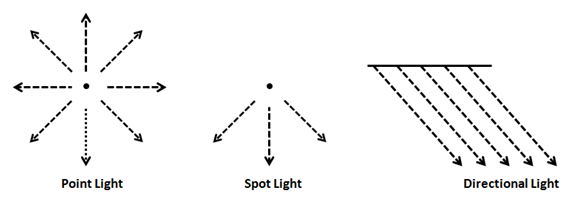

# 要有光！（Let there be light）

在本章中，我们将学习如何为我们的3D游戏引擎添加光照。 我们不会去实现一个完美的物理光照模型，因为抛开复杂性不说，它还需要巨量的计算机资源，相反我们只需要一个近似的、像样的光照效果。 我们将使用一种名为 __Phong__ 的着色算法（由Bui Tuong Phong开发）。 另一个需要注意的是，我们将只模拟灯光，但我们不会模拟这些灯光所产生的阴影（这将在其他章节中完成）。

在开始之前，首先定义几个光源种类：

* 点光源：这种光源模拟的是一个由点向空间各个方向均匀散射的光源

* 射线源：这种光源模拟从空间中的点发射的光源，但不是在所有方向上发射，而是限定在了一个锥形方向上

* 平行光源：这种光源模拟了太阳光，3D场景中的所有物体都会受到来自特定方向的平行光线的照射。 无论物体是近抑或是远，光线都是以一定角度照射在物体上的。

* 环境光：这种类型的光源来自空间的任何地方，并以相同的方式照亮所有物体。



因此，为了模拟光，我们需要考虑光源类型，以及光的位置和其他一些参数，如颜色。 当然，我们还必须考虑物体如何受光照影响及吸收和反射光。

Phong着色算法将模拟光线对我们模型中每个点的影响，即每个顶点的影响。 这就是为什么它被称为局部光照模型的原因，这也是该算法不能计算阴影的原因，它只会计算应用到每个顶点的光，而不考虑顶点是否在挡光物体的后面。 我们将在后面的章节中解决这个问题。 但是，正因为如此，它是一种非常简单快速的算法，并且可以提供非常好的效果。 我们将在这里使用一个没有深入考虑材质的简化版本。

Phong算法提供了三种光照分量：

* 环境光：模拟来自任何地方的光，这将为我们提供（需要对应强度值）未被任何光线照射的区域，就像背景光。

* 漫反射：考虑到面对光源的表面更亮。

* 高光：模拟光线如何在抛光或金属表面上反射。

最后，我们还要知道的规律是，乘以分配给片段的颜色，将根据接收的光线将该颜色变得更亮或更暗。我们令$A$为环境组光、$D$为漫反射、$S$为高光。 以上规律对于分量的加法表示如下：

$$L = A + D + S$$

这些分量其实就是颜色，也就是每个光分量所贡献的颜色分量。 这是因为光分量不仅会提供一定程度的强度，还会改变模型的颜色。在我们的片段着色器中，我们只需将该光的颜色与原始片段颜色（从纹理或基色获得）相乘即可。

我们也可以为相同的材质分配不同的颜色，这些颜色将用于环境，漫反射和高光分量。 因此，这些分量将由材质相关的颜色而受到调整。 如果材质具有纹理，我们将简单地为每个分量使用单个纹理。

所以对于非纹理材质的最终颜色将是：$L = A * 环境光色 + D * 漫反射的颜色 + S * 高光颜色$

对于有纹理材质的最终颜色将是：

$$L = A * 材质颜色 + D * 材质颜色 + S * 材质颜色$$

## 环境光分量

让我们来看看第一个分量，即环境光分量，它只是一个常量值，会使我们的所有对象变得更亮或更暗。 我们可以使用它来模拟特定时间段内的光线（黎明，黄昏等），也可以用它来添加一些光线，这些光线不直接被光线照射，但可以以简单的方式被间接光线照射（比如反射）。

环境光是运算最简单的分量，我们只需要传递一种颜色，并乘以基本颜色，以调整该基本颜色。 假如我们已经确定片段的颜色是$（1.0，0.0，0.0）$，即红色。 如果没有环境光时，它将显示为完全红色的片段。 如果我们将环境光设置为$（0.5,0.5,0.5）$，则最终颜色将为$（0.5,0,0）$，其实就是变暗的红色。 这种光会以同样的方式使所有片段变暗（说光照暗了物体似乎有点奇怪，实际上这就是我们得到的效果）。除此之外，如果光色的RGB分量不相同，它还可以为片段添加一些颜色，所以我们只需要一个向量来调节环境光强度和颜色。

## 漫反射

现在我们来谈谈漫反射。 它模拟了这样的规律，即与光源垂直的面看起来比以更接近光的角度接收光的面更亮。 一个物体接收的光线越多，其光密度（让我这样称呼）就越高。


但是，我们该如何计算它？ 你还记得上一章我们介绍过的法线概念吗？ 法线是垂直于平面并且长度为1的向量。 因此，让我们在上图中绘制三个点的法线，如你所见，每个点的法线将是垂直于每个点的切平面的向量。 我们不去绘制来自光源的光线，而是绘制从每个点到光源（即相反的方向）的向量。


正如你所看到的，$P1$点的法线$N1$，与指向光源的向量平行，该法线的方向与光线的方向相反（$N1$已经被平移标记，以便你可以看到它，但它在数学上是等价的）。$P1$相对于指向光源的向量，其角度等于$0$。 因为它的平面垂直于光源，所以$P1$将是最亮的点。

$P2$点的法线$N2$，与指向光源的向量的夹角约为30度，所以它应该比$P1$更暗。最后，$P3$的法线$N3$也与指向光源的向量平行，但两个向量的方向相反。 $P3$与指向光源的向量的角度为180度，所以根本不应该获得任何光线。

所以，看起来我们得到了一个计算某个点的光照强度的好方法，光强与该点的法线和该点指向光源的向量之间的夹角大小有关。但我们具体要怎么计算它呢？

有一个我们可以使用的数学运算————点积。 该操作需要两个向量并产生一个数字（标量），如果它们之间的角度较小，则生成一个正数；如果它们之间的角度很大，则生成一个负数。 如果两个向量都被归一化，即两者的长度都等于1，那么点积的结果将介于$-1$和$1$之间。 如果两个向量的方向相同（即夹角为$0$），则点积为1；如果两个向量夹角为直角，则它的值为$0$；如果两个向量的方向相反，则为$-1$。

我们定义两个向量，$v1$和$v2$，并以$$α$$作为它们之间的夹角。点积的定义如下：


如果两个向量都归一化，即它们的长度，它们的模块将等于1，它们的点积即为夹角的余弦值。 我们同样使用该运算来计算漫反射分量。

所以我们需要计算指向光源的向量。 我们如何做到这一点？ 假如我们有每个点的位置（即顶点位置），我们有光源的位置。首先，这两个坐标必须位于相同的坐标系中。 为了简化，让我们假设它们都处于世界坐标系中，那么这些位置是指向顶点位置（$VP$）和光源（$VS$）的矢量的坐标，如下图所示：


如果我们从$VP$中减去$VS$，我们就得到了$L$向量。

现在，我们可以在指向光源的矢量和法线之间做点积，因为Johann Lambert是第一个提出这种关系来模拟平面亮度的，所以该乘积被称为兰伯特项。

让我们总结一下，我们定义以下变量：

* $vPos$ ：我们的顶点在模型视图空间坐标中的位置。
* $lPos$：视图空间坐标中的光线位置。
* $intensity$：光的强度（从0到1）。
* $lCourour$：光的颜色。
* $normal$：顶点法线。

首先，我们需要计算从当前位置指向光源的向量：$toLightDirection = lPos - vPos$。该操作的结果需要进行归一化。

然后我们需要计算漫反射因子（标量）：$diffuseFactor = normal \cdot toLightDirection$。计算两个向量之间的点积，我们希望它在$-1$和$1$之间，所以两个向量都需要进行归一化。颜色需要在$0$到$1$之间，所以如果值低于$0$，我们将它设置为$0$。

最后，我们只需要通过漫射因子和光强来调制光色：

$$ color = diffuseColour * lColour * diffuseFactor * intensity$$

## 高光分量

现在我们来看看高光分量，但首先我们需要知道光线是如何反射的。 当光照射到一个平面时，它的一部分被吸收，另一部分被反射，如果你还记得你的物理课内容，反射就是光子从物体反弹回来。


当然，平面不是完全抛光的，如果你近距离仔细观察，你会看到很多不平整的地方。 除此之外，有许多射线光（实际上是光子），会撞击这个平面，并且会以各种各样的角度进行反射。 因此，我们看到的就像是一束光照射一平面并散射出去。 也就是说，光线在撞击平面时会发散，这就是我们之前讨论过的漫射分量。


但是，当光线照射抛光平面时，例如金属，光线会受到较低扩散的影响，并且大部分光线会反射到相反的方向。


这就是高光分量模型，它取决于材质特性。关于镜面反射，要注意的一点是，只有当摄像机处于适当的位置时，即反射光的发射区域内，反射光才可见。


解释了反射的机制，我们接下来准备计算这个分量。首先，我们需要一个从光源指向顶点的向量。当我们计算漫反射分量时，我们使用的是方向与之相反的向量，它指向的是光源。 $toLightDirection$，所以让我们将其计算为$fromLightDirection = -(toLightDirection)$。

然后我们需要计算正常情况下由$fromLightDirection$到平面所产生的反射光。有一个名为reflect的GLSL函数。所以，$reflectLight = reflect(fromLightSource, normal)$。

我们还需要一个指向相机的向量，并将其命名为$cameraDirection$，然后计算出相机位置和顶点位置之间的差值：$cameraDirection = cameraPos - vPos$。相机位置向量和顶点位置需要处于相同的坐标系中，并且生成的向量需要进行归一化。下图概述了我们目前计算的主要分量：


现在我们需要计算光强，即$specularFactor$。如果$cameraDirection$和$reflectLight$向量指向相同的方向，该值就越高，如果它们方向相反其值则越低。为了计算这个值我们将再次使用点积。$specularFactor = cameraDirection \cdot reflectLight$。我们只希望这个值在$0$和$1$之间，所以如果它低于$0$，就设置它为0。

我们还需要考虑到，如果相机指向反射光锥，则该光更强烈。这可以通过计算$specularFactor$的$specularPower$幂来实现，其中$specularPower$为给定的参数：

$$ specularFactor = specularFactor ^ {specularPower} $$。

最后，我们需要对材质的反射率进行建模，反射率将影响反射光的强度，这将使用一个名为reflectance的参数。所以镜面反射分量的颜色分量为：$$ specularColour * lColour * reflectance * specularFactor * intensity $$。

## 衰减

我们现在知道如何计算这三个分量了，这些分量可以帮助我们用环境光模拟点光源。 但是我们的光照模型还不完整，物体反射的光与光的距离无关，我们需要模拟光线衰减。

衰减是一个有关距离和光的函数。光的强度与距离的平方成反比。这很容易理解，随着光线的传播，其能量沿着球体表面分布，其半径等于光线行进的距离，而球的表面与其半径的平方成正比。我们可以用下式来计算衰减因子：$1.0 /(atConstant + atLineardist + atExponentdist ^ {2})$。

为了模拟衰减，我们只需要将衰减因子乘以最终的颜色即可。

## 实现

现在我们可以开始编程实现上面描述的所有概念，我们将从着色器开始。大部分工作将在片段着色器中完成，但我们还需要将顶点着色器中的一些数据传递给它。在前一章中，片段着色器只是接收纹理坐标，现在我们还将传递两个参数：

* 已转换为模型视图空间坐标系并已归一化的顶点法线。
* 已转换为模型视图空间坐标系的顶点位置。

这是顶点着色器的代码：

```glsl
#version 330

layout (location=0) in vec3 position;
layout (location=1) in vec2 texCoord;
layout (location=2) in vec3 vertexNormal;

out vec2 outTexCoord;
out vec3 mvVertexNormal;
out vec3 mvVertexPos;

uniform mat4 modelViewMatrix;
uniform mat4 projectionMatrix;

void main()
{
    vec4 mvPos = modelViewMatrix * vec4(position, 1.0);
    gl_Position = projectionMatrix * mvPos;
    outTexCoord = texCoord;
    mvVertexNormal = normalize(modelViewMatrix * vec4(vertexNormal, 0.0)).xyz;
    mvVertexPos = mvPos.xyz;
}
```

在我们继续讲解片段着色器之前，必须强调一个非常重要的概念。从上面的代码可以看到，`mvVertexNormal`，该变量包含已转换为模型视图空间坐标的顶点法线。这是通过将`vertexNormal`乘上`modelViewMatrix`来实现的，就像顶点位置一样。但有一个细微的差别，该顶点法线的w分量在乘以矩阵之前被设置为0：`vec4（vertexNormal，0.0）`。我们为什么要这样做呢 ？因为我们希望法线可以旋转和缩放，但我们不希望它被变换，所以我们只对它的方向感兴趣，而不是它的位置。而这是通过将w分量设置为0来实现的，这也是是使用齐次坐标的优点之一，通过设置w分量，我们可以控制应用了哪些变换。你可以用手做矩阵乘法，看看为什么是这样。

现在我们可以开始在片段着色器中干点事情了，除了将来自顶点着色器的值声明为输入参数之外，我们将定义一些有用的结构体来模拟光照和材质特性。首先，我们将定义用于模拟光的结构。

```glsl
struct Attenuation
{
    float constant;
    float linear;
    float exponent;
};

struct PointLight
{
    vec3 colour;
    // 光源位置是在视图坐标系中的
    vec3 position;
    float intensity;
    Attenuation att;
};
```
