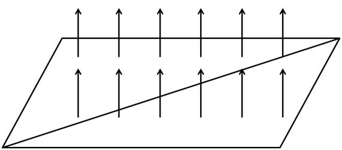
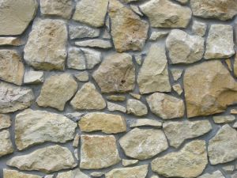

# 法线贴图（Normal Mapping）

本章中将讲解一项技术，它将极大地改善我们的3D模型的外观。到目前为止，我们已经能够将纹理使用到复杂的3D模型上，但这还离真实物体的样子很远。现实世界中的物体表面不是完全光滑的，它们有我们的3D模型目前所不具有的瑕疵。

为了渲染更真实的场景，我们将渲染**法线贴图(Normal Mapping)**。如果你在现实世界中看到一个平面，你会发现那些瑕疵甚至可以在很远的距离看到。在3D场景中，平面不会有下次，我们可以将纹理应用在它上，但这不会改变光反射的方式。这就是为什么有区别的原因。

我们可以考虑通过增加三角形数量来增加模型的细节并反映出这些瑕疵，但性能会下降。我们需要的是改变表面光反射的方式来增加真实感。这就是用法线贴图技术实现的。

让我们看看光滑平面的例子，一个平面由两个三角形组成为一个四边形。回忆之前的光照章节，模型的光反射的要素是平面法线。在此情况下，我们整个平面仅有单一的法线，当计算光如何影响片元时，每个片元都使用相同的法线。看起来就像下图那样。



如果可以改变平面的每个片元的法线，我们就可以模拟平面的瑕疵，使它们更逼真。看起来就像下图那样。


要做到这一点，我们要加载另一个纹理，它储存面的法线。法线纹理的每个像素将以RGB值储存法线的**x**、**y**和**z**坐标值。

让我们用下面的纹理绘制一个四边形。



上图的法线纹理如下所示。


如你所见，如果我们把颜色变换应用到原始纹理，每个像素使用颜色分量储存法线信息。在看到法线贴图时，你常常会看到主色调倾向于蓝色，这是由于大多数法线指向转换正**z**轴所致。在一个平面表面的矢量中，**z**分量通常比**x**和**y**分量的值高得多。由于**x**、**y**、**z**坐标被映射到RGB，导致蓝色分量也有着更高的值。

因此，使用法线贴图渲染对象只需要一个额外的纹理，并同时使用它渲染片元以获得适当的法线值。

让我们开始修改代码，以支持法线贴图。我们将添加一个新的`Texture`实例到`Material`类，这样就可以把一个法线贴图纹理添加到游戏项目上。此实例将有自己的`get`和`set`方法，并有方法可以检查`Material`是否有法线贴图。

```java
public class Material {

    private static final Vector4f DEFAULT_COLOUR = new Vector3f(1.0f, 1.0f, 1.0f, 10.f);

    private Vector3f ambientColour;

    private Vector3f diffuseColour;

    private Vector3f specularColour;
    
    private float reflectance;

    private Texture texture;

    private Texture normalMap;

    // … Previous code here

    public boolean hasNormalMap() {
        return this.normalMap != null;
    }

    public Texture getNormalMap() {
        return normalMap;
    }

    public void setNormalMap(Texture normalMap) {
        this.normalMap = normalMap;
    }
}
```

我们将在场景的片元着色器中使用法线贴图纹理。
We will use the normal map texture in the scene fragment shader. But, since we are working in view coordinates space we need to pass the model view matrix in order to do the proper transformation. Thus, we need to modify the scene vertex shader.

```glsl
#version 330

layout (location=0) in vec3 position;
layout (location=1) in vec2 texCoord;
layout (location=2) in vec3 vertexNormal;

out vec2 outTexCoord;
out vec3 mvVertexNormal;
out vec3 mvVertexPos;
out mat4 outModelViewMatrix;

uniform mat4 modelViewMatrix;
uniform mat4 projectionMatrix;

void main()
{
    vec4 mvPos = modelViewMatrix * vec4(position, 1.0);
    gl_Position = projectionMatrix * mvPos;
    outTexCoord = texCoord;
    mvVertexNormal = normalize(modelViewMatrix * vec4(vertexNormal, 0.0)).xyz;
    mvVertexPos = mvPos.xyz;
    outModelViewMatrix = modelViewMatrix;
}
```

In the scene fragment shader we need to add another input parameter.

```glsl
in mat4 outModelViewMatrix;
```

In the fragment shader, we will need to pass a new uniform for the normal map texture sampler:

```glsl
uniform sampler2D texture_sampler;
```

Also, in the fragment shader, we will create a new function that calculates the normal for the current fragment.

```glsl
vec3 calcNormal(Material material, vec3 normal, vec2 text_coord, mat4 modelViewMatrix)
{
    vec3 newNormal = normal;
    if ( material.hasNormalMap == 1 )
    {
        newNormal = texture(normalMap, text_coord).rgb;
        newNormal = normalize(newNormal * 2 - 1);
        newNormal = normalize(modelViewMatrix * vec4(newNormal, 0.0)).xyz;
    }
    return newNormal;
}
```

The function takes the following parameters:

* The material instance.
* The vertex normal.
* The texture coordinates.
* The model view matrix.

The first thing we do in that function is to check if this material has a normal map associated or not. If not, we just simply use the vertex normal as usual. If it has a normal map, we use the normal data stored in the normal texture map associated to the current texture coordinates.

Remember that the colour we get are the normal coordinates, but since they are stored as RGB values they are contained in the range \[0, 1\]. We need to transform them to be in the range \[-1, 1\], so we just multiply by two and subtract 1 . Then, we normalize that value and transform it to view model coordinate space \(as with the vertex normal\).

And that’s all, we can use the returned value as the normal for that fragment in all the lightning calculations.

In the `Renderer` class we need to create the normal map uniform, and in the `renderScene` method we need to set it up like this:

```java
...
sceneShaderProgram.setUniform("fog", scene.getFog());
sceneShaderProgram.setUniform("texture_sampler", 0);
sceneShaderProgram.setUniform("normalMap", 1);
...
```

You may notice some interesting thing in the code above. We are setting $$0$$ for the material texture uniform \(`texture_sampler`\) and $$1$$ for the normal map texture \(`normalMap`\). If you recall from the texture chapter. We are using more than one texture, so we must set up the texture unit for each separate texture.

We need to take this also into consideration when we are rendering a `Mesh`.

```java
private void initRender() {
    Texture texture = material.getTexture();
    if (texture != null) {
        // Activate first texture bank
        glActiveTexture(GL_TEXTURE0);
        // Bind the texture
        glBindTexture(GL_TEXTURE_2D, texture.getId());
    }
    Texture normalMap = material.getNormalMap();
    if ( normalMap != null ) {
        // Activate first texture bank
        glActiveTexture(GL_TEXTURE1);
        // Bind the texture
        glBindTexture(GL_TEXTURE_2D, normalMap.getId());
    }

    // Draw the mesh
    glBindVertexArray(getVaoId());
    glEnableVertexAttribArray(0);
    glEnableVertexAttribArray(1);
    glEnableVertexAttribArray(2);
}
```

As you can see we need to bind to each of the textures available and activate the associated texture unit in order to be able to work with more than one texture. In the `renderScene` method in the `Renderer` class we do not need to explicitly set up the uniform of the texture since it’s already contained in the `Material`.

In order to show the improvements that normal maps provide, we have created an example that shows two quads side by side. The right quad has a texture map applied and the left one not. We also have removed the terrain, the skybox and the HUD and setup a directional light with can be changed with the left and right cursor keys so you can see the effect. We have modified the base source code a bit in order to support not having a skybox or a terrain. We have also clamped the light effect in the fragment shader in the rang \[0, 1\] to avoid over exposing effect of the image.

The result is shown in the next figure.


As you can see the quad that has a normal texture applied gives the impression of having more volume. Although it is, in essence, a plain surface like the other quad, you can see how the light reflects.  
But, although the code we have set up, works perfectly with this example you need to be aware of its limitations. The code only works for normal map textures that are created using object space coordinates. If this is the case we can apply the model view matrix transformations to translate the normal coordinates to the view space.

But, usually normal maps are not defined in that way. They usually are defined in the called tangent space. The tangent space is a coordinate system that is local to each triangle of the model. In that coordinate space the $$z$$ axis always points out of the surface. This is the reason why when you look at a normal map its usually bluish, even for complex models with opposing faces.

We will stick with this simple implementation by now, but keep in mind that you must always use normal maps defined in object space. If you use maps defined in tangent space you will get weird results. In order to be able to work with them we need to setup specific matrices to transform coordinates to the tangent space.

