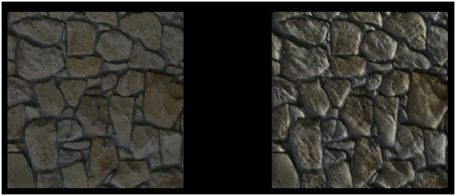

# 法线贴图（Normal Mapping）

本章中将讲解一项技术，它将极大地改善我们的3D模型的外观。到目前为止，我们已经能够将纹理使用到复杂的3D模型上，但这还离真实物体的样子很远。现实世界中的物体表面不是完全光滑的，它们有我们的3D模型目前所不具有的瑕疵。

为了渲染更真实的场景，我们将渲染**法线贴图(Normal Mapping)**。如果你在现实世界中看到一个平面，你会发现那些瑕疵甚至可以在很远的距离看到。在3D场景中，平面不会有下次，我们可以将纹理应用在它上，但这不会改变光反射的方式。这就是为什么有区别的原因。

我们可以考虑通过增加三角形数量来增加模型的细节并反映出这些瑕疵，但性能会下降。我们需要的是改变表面光反射的方式来增加真实感。这就是用法线贴图技术实现的。

让我们看看光滑平面的例子，一个平面由两个三角形组成为一个四边形。回忆之前的光照章节，模型的光反射的要素是平面法线。在此情况下，我们整个平面仅有单一的法线，当计算光如何影响片元时，每个片元都使用相同的法线。看起来就像下图那样。


如果可以改变平面的每个片元的法线，我们就可以模拟平面的瑕疵，使它们更逼真。看起来就像下图那样。


要做到这一点，我们要加载另一个纹理，它储存面的法线。法线纹理的每个像素将以RGB值储存法线的**x**、**y**和**z**坐标值。

让我们用下面的纹理绘制一个四边形。


上图的法线纹理如下所示。


如你所见，如果我们把颜色变换应用到原始纹理，每个像素使用颜色分量储存法线信息。在看到法线贴图时，你常常会看到主色调倾向于蓝色，这是由于大多数法线指向转换正**z**轴所致。在一个平面表面的矢量中，**z**分量通常比**x**和**y**分量的值高得多。由于**x**、**y**、**z**坐标被映射到RGB，导致蓝色分量也有着更高的值。

因此，使用法线贴图渲染对象只需要一个额外的纹理，并同时使用它渲染片元以获得适当的法线值。

让我们开始修改代码，以支持法线贴图。我们将添加一个新的`Texture`实例到`Material`类，这样就可以把一个法线贴图纹理添加到游戏项目上。此实例将有自己的`get`和`set`方法，并有方法可以检查`Material`是否有法线贴图。

```java
public class Material {

    private static final Vector4f DEFAULT_COLOUR = new Vector3f(1.0f, 1.0f, 1.0f, 10.f);

    private Vector3f ambientColour;

    private Vector3f diffuseColour;

    private Vector3f specularColour;
    
    private float reflectance;

    private Texture texture;

    private Texture normalMap;

    // … Previous code here

    public boolean hasNormalMap() {
        return this.normalMap != null;
    }

    public Texture getNormalMap() {
        return normalMap;
    }

    public void setNormalMap(Texture normalMap) {
        this.normalMap = normalMap;
    }
}
```

我们将在场景的片元着色器中使用法线贴图纹理。但是，由于我们在观察坐标空间操作，所以需要通过模型观察矩阵来进行适当的变换。因此，我们需要修改场景的顶点着色器。

```glsl
#version 330

layout (location=0) in vec3 position;
layout (location=1) in vec2 texCoord;
layout (location=2) in vec3 vertexNormal;

out vec2 outTexCoord;
out vec3 mvVertexNormal;
out vec3 mvVertexPos;
out mat4 outModelViewMatrix;

uniform mat4 modelViewMatrix;
uniform mat4 projectionMatrix;

void main()
{
    vec4 mvPos = modelViewMatrix * vec4(position, 1.0);
    gl_Position = projectionMatrix * mvPos;
    outTexCoord = texCoord;
    mvVertexNormal = normalize(modelViewMatrix * vec4(vertexNormal, 0.0)).xyz;
    mvVertexPos = mvPos.xyz;
    outModelViewMatrix = modelViewMatrix;
}
```

在场景的片元着色器中，我们需要添加另一个输入参数。

```glsl
in mat4 outModelViewMatrix;
```

在片元着色器中，我们需要为法线贴图纹理采样器传递一个新的Uniform：

```glsl
uniform sampler2D texture_sampler;
```

此外，在片元着色器中，我们将创建一个新函数，该函数计算当前片元的法线。

```glsl
vec3 calcNormal(Material material, vec3 normal, vec2 text_coord, mat4 modelViewMatrix)
{
    vec3 newNormal = normal;
    if ( material.hasNormalMap == 1 )
    {
        newNormal = texture(normalMap, text_coord).rgb;
        newNormal = normalize(newNormal * 2 - 1);
        newNormal = normalize(modelViewMatrix * vec4(newNormal, 0.0)).xyz;
    }
    return newNormal;
}
```

该函数有以下参数：
* `Material`实例。
* 顶点法线。
* 纹理坐标。
* 模型视图矩阵。

我们在此函数中做的第一件事是检查这个`Material`实例是否有法线贴图。如果没有，我们就像平常一样简单地使用顶点法线。如果它有法线贴图，我们使用储存着法线数据的法线纹理关联到当前纹理坐标。

记住我们取得的颜色是法线坐标，但因为它们被储存为RGB值，所以它们的值在范围\[0, 1\]中。我们需要将其范围转换为\[-1, 1\]，所以我们将其乘以2然后减去1。然后，我们将它归一化，并将其转换到模型观察坐标系（就像顶点法线那样）。

就这样，我们可以使用返回值作为片元所有光照计算中的法线。

在`Renderer`类中，我们需要创建法线贴图，在`renderScene`方法中，我们做如下设置：

```java
//...
sceneShaderProgram.setUniform("fog", scene.getFog());
sceneShaderProgram.setUniform("texture_sampler", 0);
sceneShaderProgram.setUniform("normalMap", 1);
//...
```

上述代码中你可能注意到一些有趣的事情。我们将材质纹理Uniform（`texture_sampler`）设置为**0**，然后将法线贴图纹理（`normalMap`）设置为**1**。如果你回想纹理章节，我们不止使用一个纹理，所以我们必须为每个单独的纹理设置纹理单元。

当我们渲染`Mesh`时，也需要考虑这一点。

```java
private void initRender() {
    Texture texture = material.getTexture();
    if (texture != null) {
        // 激活第一纹理库
        glActiveTexture(GL_TEXTURE0);
        // 绑定纹理
        glBindTexture(GL_TEXTURE_2D, texture.getId());
    }
    Texture normalMap = material.getNormalMap();
    if ( normalMap != null ) {
        // 激活第二纹理库
        glActiveTexture(GL_TEXTURE1);
        // 绑定纹理
        glBindTexture(GL_TEXTURE_2D, normalMap.getId());
    }

    // 绘制网格
    glBindVertexArray(getVaoId());
    glEnableVertexAttribArray(0);
    glEnableVertexAttribArray(1);
    glEnableVertexAttribArray(2);
}
```

如你所见，我们需要绑定每个可用的纹理，并激活相关的纹理单元，以便多个纹理能够同时工作。在`Renderer`类的`renderScene`方法中，我们不需要显式设置纹理的Uniform，因为它已经包含在`Material`中。

为了展示法线贴图带来的提升，我已经创建了两个并排显示的四边形示例。右边的有一张法线贴图，而左边没有。我们还删除了地形、天空盒和HUD，并设置了平行光照，可以用鼠标左右键改变方向，这样你就可以看到效果了。我已经修改了基本源代码，以支持关闭天空盒和地形。我们还在片元着色器中设置了光效果的范围为\[0, 1\]，以避免图像过度曝光。

结果如下图所示。



如你所见，具有法线贴图的四边形感觉更大。虽然它本质上是一个像其他四边形一样的平面，但你可以看到光线是如何反射的。

尽管我们已经编写的代码完全符合这个示例，但你需要知道它的局限性。该代码仅适用与使用模型坐标空间创建的法线贴图纹理。如果是这种情况，我们可以使用模型视图矩阵来将法线坐标转换到观察空间。

但通常法线贴图不是这样定义的。它们通常被定义在所谓的**切线空间（`Tangent Space`）**中。切线空间是一个坐标系，它定位在模型的每个三角形，其坐标系的**z**轴总是垂直于表面。这就是为什么当你看一个法线贴图时，它通常是蓝色的，甚至对于面相对复杂的模型也是如此。

我们现在仍使用这个简单的实现，但请记住，你必须总是使用在模型空间中定义的法线贴图。如果使用切线空间中定义的贴图，就会变得很奇怪。为了能够让它们一同工作，我们需要使用特定的矩阵来将坐标变换到切线空间。

